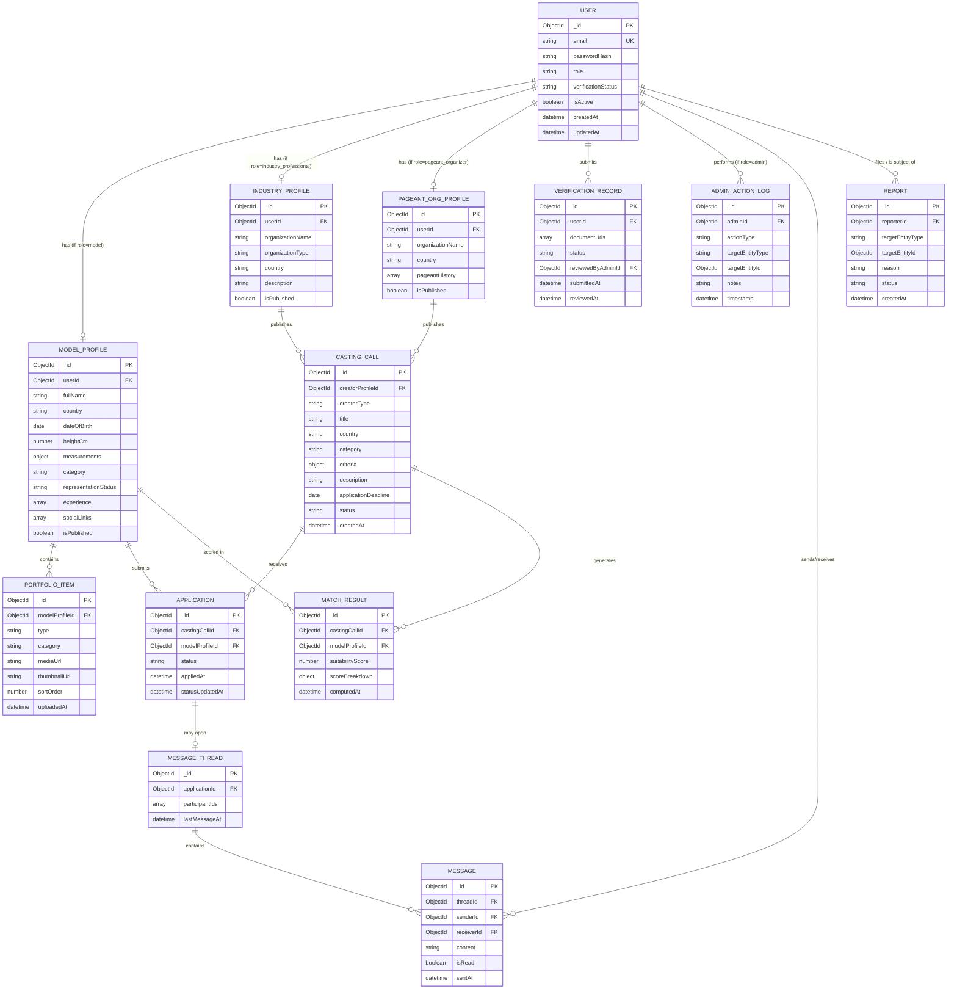

# Database Design Document (DDD)
## Global Multidimensional Talent Marketplace and Casting Management System

| Field | Detail |
|---|---|
| **Document Type** | Database Design Document (Entity-Relationship Diagram + Schema) |
| **Product Name** | Global Multidimensional Talent Marketplace and Casting Management System |
| **Prepared For** | Sandun Prabath (A.M.S.P Athapaththu), BSc (Hons) Software Engineering — NSBM Green University |
| **Document Version** | 2.0 |
| **Status** | Active — Approved for Build |
| **Database Engine** | MongoDB (Atlas, managed) |
| **Companion Documents** | PRD v2.0, SRS v2.0, System Architecture Design Document v2.0, API Specification v2.0 |

---

## Revision History

| Version | Date | Description | Author |
|---|---|---|---|
| 1.0 | 2026-03-01 | Initial database design derived from PRD §11 and SRS §6 | Product/Engineering Team |
| 2.0 | 2026-09-08 | Added `refresh_tokens` collection (supports JWT refresh-token strategy from SADD ADR-03); added `notifications` collection; updated ERD to include both new entities; added index entries for new collections; updated status to Active | Engineering Team |

---

## 1. Introduction

### 1.1 Purpose
This document provides the complete data design for the Global Multidimensional Talent Marketplace and Casting Management System: the conceptual Entity-Relationship Diagram (ERD), the logical data model, the physical MongoDB schema definitions (collections, field types, constraints, and indexes), relationship-management strategy, sample documents, and data governance policies (retention, integrity, migration).

### 1.2 Scope
Covers all persistent data entities required to support the functional requirements defined in the SRS: user accounts and authentication, role-specific profiles, portfolios, casting calls, applications, messaging, verification records, and administrative logs. Media *binary* content is explicitly out of scope for this database (see §2.3 — stored in cloud object storage, referenced by URL only).

### 1.3 Database Technology Rationale
MongoDB (a document-oriented NoSQL database) was selected over a relational database (see Architecture ADR-02) because:
- The three primary profile types (Model, Industry Professional, Pageant Organizer) share some fields but diverge significantly in structure — a document model avoids complex polymorphic-association or multi-table-per-type relational patterns.
- Portfolio and casting-criteria data are naturally nested/array-based (e.g., a list of portfolio items, a set of casting requirements), which maps cleanly to embedded sub-documents.
- Native JSON document structure aligns with the Node.js/Express REST API without an object-relational mapping translation layer.
- MongoDB Atlas provides managed hosting, indexing, and horizontal scalability appropriate for the project's cloud deployment strategy.

---

## 2. Database Design Principles

### 2.1 Embedding vs. Referencing Strategy
MongoDB schema design requires an explicit decision, per relationship, between **embedding** (nesting related data inside a parent document) and **referencing** (storing an ID and querying a separate collection). This document applies the following principles:

| Relationship | Strategy | Rationale |
|---|---|---|
| User → Role-specific Profile | **Referencing** (1:1, separate collections) | Keeps the core `users` collection lean and role-agnostic; profile schema varies significantly by role |
| ModelProfile → PortfolioItem | **Referencing** (1:N, separate collection) | Portfolio items can grow large in number and are independently queried/updated (delete/reorder) without rewriting the whole profile |
| CastingCall → Criteria | **Embedding** (sub-document) | Criteria are inherently part of the casting call, always read/written together, and bounded in size |
| CastingCall → Application | **Referencing** (1:N, separate collection) | Applications are created independently over time, queried from both the casting-call side and the talent side, and can grow unbounded |
| Message Thread → Message | **Referencing** (1:N, separate collection, indexed by `thread_id`) | Message volume per thread can grow large; referencing avoids unbounded document growth (MongoDB's 16MB document size limit) |
| User → VerificationRecord | **Referencing** (1:N, separate collection) | Preserves a full audit history of verification submissions/decisions over time |

### 2.2 Naming Conventions
- Collections: lowercase, plural, snake_case where multi-word (e.g., `users`, `model_profiles`, `casting_calls`).
- Fields: camelCase (e.g., `createdAt`, `verificationStatus`) for consistency with the JavaScript/Node.js application layer.
- All documents include `_id` (MongoDB ObjectId, primary key), `createdAt`, and `updatedAt` timestamp fields.

### 2.3 Media Storage Boundary
Raw image/video binary data is **never** stored in MongoDB. The `portfolio_items` collection stores only metadata and **URLs** referencing objects held in cloud object storage (AWS S3 / Firebase Storage / Google Cloud Storage), consistent with the System Architecture Design Document §3.2 and SRS-FR-4.7.

---

## 3. Conceptual Entity-Relationship Diagram



**Cardinality Notes:**
- A `User` has **exactly one** role-specific profile document, determined by `role` (enforced at the application layer, not by MongoDB natively — see §7.1).
- A `ModelProfile` has **zero-to-many** `PortfolioItem`s and **zero-to-many** `Application`s.
- An `IndustryProfile` or `PageantOrgProfile` has **zero-to-many** `CastingCall`s.
- A `CastingCall` has **zero-to-many** `Application`s and **zero-to-many** `MatchResult`s (one per scored candidate).
- An `Application` **may** have **at most one** `MessageThread`, which contains **zero-to-many** `Message`s.

---

## 4. Logical Data Model and Physical Schema

Each collection below is specified with field name, type, constraints, and purpose, followed by the Mongoose-style schema definition for direct engineering use.

### 4.1 Collection: `users`

| Field | Type | Constraints | Description |
|---|---|---|---|
| `_id` | ObjectId | PK, auto-generated | Unique user identifier |
| `email` | String | Required, unique, indexed, valid email format | Login identifier |
| `passwordHash` | String | Required | bcrypt hash; never returned via API |
| `role` | String (enum) | Required: `model`, `industry_professional`, `pageant_organizer`, `admin` | Determines RBAC and which profile collection applies |
| `verificationStatus` | String (enum) | Default `unverified`: `unverified`, `pending`, `verified`, `rejected` | Trust/verification state |
| `isActive` | Boolean | Default `true` | Enables soft-suspend without deletion |
| `failedLoginAttempts` | Number | Default `0` | Supports account-lockout logic (SRS-FR-1.10) |
| `lockedUntil` | Date | Nullable | Temporary lockout expiry timestamp |
| `createdAt` | Date | Auto | Record creation timestamp |
| `updatedAt` | Date | Auto | Record last-modified timestamp |

```javascript
// users collection — Mongoose schema
const userSchema = new Schema({
  email: { type: String, required: true, unique: true, lowercase: true, trim: true },
  passwordHash: { type: String, required: true, select: false },
  role: { type: String, required: true, enum: ['model', 'industry_professional', 'pageant_organizer', 'admin'] },
  verificationStatus: { type: String, enum: ['unverified', 'pending', 'verified', 'rejected'], default: 'unverified' },
  isActive: { type: Boolean, default: true },
  failedLoginAttempts: { type: Number, default: 0 },
  lockedUntil: { type: Date, default: null }
}, { timestamps: true });

userSchema.index({ email: 1 }, { unique: true });
userSchema.index({ role: 1 });
```

---

### 4.2 Collection: `model_profiles`

| Field | Type | Constraints | Description |
|---|---|---|---|
| `_id` | ObjectId | PK | Unique profile identifier |
| `userId` | ObjectId | Required, unique, ref `users`, indexed | Owning user account |
| `fullName` | String | Required | Display name |
| `country` | String | Required, indexed | Primary market/location |
| `dateOfBirth` | Date | Required | Used to derive age dynamically |
| `heightCm` | Number | Required, min 0 | Height in centimeters |
| `measurements` | Object | Optional | e.g., `{ bust, waist, hips }` |
| `category` | String (enum/controlled list) | Required, indexed | e.g., `editorial`, `commercial`, `runway`, `pageant` |
| `representationStatus` | String (enum) | Required: `freelance`, `agency_represented` | SRS-FR-1.8 |
| `agencyName` | String | Conditional (required if `agency_represented`) | Representing agency |
| `experience` | Array<Object> | Optional | `[{ title, organization, year, description }]` |
| `skills` | Array<String> | Optional | Free-form or controlled-list skill tags |
| `socialLinks` | Object | Optional | `{ instagram, tiktok }` — reference-only, non-verifying |
| `isPublished` | Boolean | Default `false` | Gates visibility in search until mandatory fields complete (SRS-FR-3.5) |

```javascript
// model_profiles collection — Mongoose schema
const modelProfileSchema = new Schema({
  userId: { type: Schema.Types.ObjectId, ref: 'User', required: true, unique: true },
  fullName: { type: String, required: true, trim: true },
  country: { type: String, required: true },
  dateOfBirth: { type: Date, required: true },
  heightCm: { type: Number, required: true, min: 0 },
  measurements: {
    bust: Number, waist: Number, hips: Number
  },
  category: { type: String, required: true },
  representationStatus: { type: String, enum: ['freelance', 'agency_represented'], required: true },
  agencyName: { type: String, default: null },
  experience: [{
    title: String, organization: String, year: Number, description: String
  }],
  skills: [{ type: String }],
  socialLinks: {
    instagram: String, tiktok: String
  },
  isPublished: { type: Boolean, default: false }
}, { timestamps: true });

modelProfileSchema.index({ country: 1, category: 1 });
modelProfileSchema.index({ heightCm: 1 });
modelProfileSchema.index({ dateOfBirth: 1 });
```

---

### 4.3 Collection: `industry_profiles`

| Field | Type | Constraints | Description |
|---|---|---|---|
| `_id` | ObjectId | PK | Unique profile identifier |
| `userId` | ObjectId | Required, unique, ref `users`, indexed | Owning user account |
| `organizationName` | String | Required | Brand/agency/individual professional name |
| `organizationType` | String (enum) | Required: `brand`, `director`, `agency`, `photographer` | Sub-category of industry professional |
| `country` | String | Required, indexed | Primary operating country |
| `description` | String | Optional | Bio / prior work summary |
| `website` | String | Optional | External reference link |
| `isPublished` | Boolean | Default `false` | Visibility gate |

```javascript
// industry_profiles collection — Mongoose schema
const industryProfileSchema = new Schema({
  userId: { type: Schema.Types.ObjectId, ref: 'User', required: true, unique: true },
  organizationName: { type: String, required: true, trim: true },
  organizationType: { type: String, enum: ['brand', 'director', 'agency', 'photographer'], required: true },
  country: { type: String, required: true },
  description: { type: String, default: '' },
  website: { type: String, default: null },
  isPublished: { type: Boolean, default: false }
}, { timestamps: true });

industryProfileSchema.index({ country: 1, organizationType: 1 });
```

---

### 4.4 Collection: `pageant_org_profiles`

| Field | Type | Constraints | Description |
|---|---|---|---|
| `_id` | ObjectId | PK | Unique profile identifier |
| `userId` | ObjectId | Required, unique, ref `users`, indexed | Owning user account |
| `organizationName` | String | Required | e.g., "Miss Sri Lanka Organization" |
| `country` | String | Required, indexed | Home country/jurisdiction |
| `pageantHistory` | Array<Object> | Optional | `[{ pageantName, year, description }]` |
| `officialStatus` | String | Optional | Self-declared institutional status |
| `isPublished` | Boolean | Default `false` | Visibility gate |

```javascript
// pageant_org_profiles collection — Mongoose schema
const pageantOrgProfileSchema = new Schema({
  userId: { type: Schema.Types.ObjectId, ref: 'User', required: true, unique: true },
  organizationName: { type: String, required: true, trim: true },
  country: { type: String, required: true },
  pageantHistory: [{
    pageantName: String, year: Number, description: String
  }],
  officialStatus: { type: String, default: '' },
  isPublished: { type: Boolean, default: false }
}, { timestamps: true });

pageantOrgProfileSchema.index({ country: 1 });
```

---

### 4.5 Collection: `portfolio_items`

| Field | Type | Constraints | Description |
|---|---|---|---|
| `_id` | ObjectId | PK | Unique item identifier |
| `modelProfileId` | ObjectId | Required, ref `model_profiles`, indexed | Owning profile |
| `type` | String (enum) | Required: `photo`, `video` | Media type |
| `category` | String | Required | e.g., `runway`, `commercial`, `achievement` |
| `mediaUrl` | String | Required | Cloud storage URL of the original asset |
| `thumbnailUrl` | String | Required (auto-generated) | Preview image URL |
| `fileSizeBytes` | Number | Required | For quota/validation tracking |
| `sortOrder` | Number | Default `0` | User-controlled display order (SRS-FR-4.6) |
| `uploadedAt` | Date | Auto | Upload timestamp |

```javascript
// portfolio_items collection — Mongoose schema
const portfolioItemSchema = new Schema({
  modelProfileId: { type: Schema.Types.ObjectId, ref: 'ModelProfile', required: true },
  type: { type: String, enum: ['photo', 'video'], required: true },
  category: { type: String, required: true },
  mediaUrl: { type: String, required: true },
  thumbnailUrl: { type: String, required: true },
  fileSizeBytes: { type: Number, required: true },
  sortOrder: { type: Number, default: 0 }
}, { timestamps: { createdAt: 'uploadedAt', updatedAt: true } });

portfolioItemSchema.index({ modelProfileId: 1, sortOrder: 1 });
```

---

### 4.6 Collection: `casting_calls`

| Field | Type | Constraints | Description |
|---|---|---|---|
| `_id` | ObjectId | PK | Unique casting call identifier |
| `creatorProfileId` | ObjectId | Required, indexed | References `industry_profiles` or `pageant_org_profiles` |
| `creatorType` | String (enum) | Required: `industry_professional`, `pageant_organizer` | Disambiguates polymorphic reference |
| `title` | String | Required | Casting call headline |
| `country` | String | Required, indexed | Target country for the opportunity |
| `category` | String | Required, indexed | Talent category sought |
| `criteria` | Object | Required (embedded sub-document) | `{ minAge, maxAge, minHeightCm, maxHeightCm, experienceLevel, requiredSkills[] }` |
| `description` | String | Required | Full opportunity description |
| `applicationDeadline` | Date | Required | Deadline for applications |
| `status` | String (enum) | Default `open`: `open`, `closed`, `expired` | Lifecycle state (SRS-FR-5.5–5.7) |

```javascript
// casting_calls collection — Mongoose schema
const castingCallSchema = new Schema({
  creatorProfileId: { type: Schema.Types.ObjectId, required: true },
  creatorType: { type: String, enum: ['industry_professional', 'pageant_organizer'], required: true },
  title: { type: String, required: true, trim: true },
  country: { type: String, required: true },
  category: { type: String, required: true },
  criteria: {
    minAge: Number, maxAge: Number,
    minHeightCm: Number, maxHeightCm: Number,
    experienceLevel: String,
    requiredSkills: [{ type: String }]
  },
  description: { type: String, required: true },
  applicationDeadline: { type: Date, required: true },
  status: { type: String, enum: ['open', 'closed', 'expired'], default: 'open' }
}, { timestamps: true });

castingCallSchema.index({ country: 1, category: 1, status: 1 });
castingCallSchema.index({ applicationDeadline: 1 });
castingCallSchema.index({ creatorProfileId: 1 });
```

---

### 4.7 Collection: `applications`

| Field | Type | Constraints | Description |
|---|---|---|---|
| `_id` | ObjectId | PK | Unique application identifier |
| `castingCallId` | ObjectId | Required, ref `casting_calls`, indexed | The applied-to opportunity |
| `modelProfileId` | ObjectId | Required, ref `model_profiles`, indexed | The applicant |
| `status` | String (enum) | Default `submitted`: `submitted`, `shortlisted`, `rejected`, `accepted` | Application lifecycle (SRS-FR-6.4) |
| `statusUpdatedAt` | Date | Auto-updated on status change | For notification/audit purposes |
| `appliedAt` | Date | Auto | Submission timestamp |

```javascript
// applications collection — Mongoose schema
const applicationSchema = new Schema({
  castingCallId: { type: Schema.Types.ObjectId, ref: 'CastingCall', required: true },
  modelProfileId: { type: Schema.Types.ObjectId, ref: 'ModelProfile', required: true },
  status: { type: String, enum: ['submitted', 'shortlisted', 'rejected', 'accepted'], default: 'submitted' },
  statusUpdatedAt: { type: Date, default: Date.now }
}, { timestamps: { createdAt: 'appliedAt', updatedAt: true } });

// Compound unique index prevents duplicate applications (SRS-FR-6.2)
applicationSchema.index({ castingCallId: 1, modelProfileId: 1 }, { unique: true });
applicationSchema.index({ modelProfileId: 1, status: 1 });
applicationSchema.index({ castingCallId: 1, status: 1 });
```

---

### 4.8 Collection: `match_results` (design-stage — not implemented)

> **Implementation note:** this collection does not exist in the shipped codebase. The implemented matching engine (`backend/services/matchingEngine.js` / `backend/utils/matchScore.js`) computes suitability scores on demand for each request and does not persist them. The schema below documents a considered caching design (Architecture §8.4) that was scoped out for the pilot; treat it as a forward-looking design, not a current data-model claim.

| Field | Type | Constraints | Description |
|---|---|---|---|
| `_id` | ObjectId | PK | Unique match record |
| `castingCallId` | ObjectId | Required, ref `casting_calls`, indexed | Casting call being matched |
| `modelProfileId` | ObjectId | Required, ref `model_profiles`, indexed | Candidate scored |
| `suitabilityScore` | Number | Required, 0–100 | Computed match score (SRS-FR-8.1) |
| `scoreBreakdown` | Object | Optional | Per-attribute contribution, for transparency (SRS-FR-8.3) |
| `computedAt` | Date | Auto | Timestamp of score computation (supports cache invalidation) |

```javascript
// match_results collection — Mongoose schema
const matchResultSchema = new Schema({
  castingCallId: { type: Schema.Types.ObjectId, ref: 'CastingCall', required: true },
  modelProfileId: { type: Schema.Types.ObjectId, ref: 'ModelProfile', required: true },
  suitabilityScore: { type: Number, required: true, min: 0, max: 100 },
  scoreBreakdown: { type: Schema.Types.Mixed, default: {} }
}, { timestamps: { createdAt: 'computedAt', updatedAt: false } });

matchResultSchema.index({ castingCallId: 1, suitabilityScore: -1 });
matchResultSchema.index({ castingCallId: 1, modelProfileId: 1 }, { unique: true });
```

---

### 4.9 Collections: `message_threads` (design-stage — not implemented) and `messages` (implemented as `Message.js`)

> **Implementation note:** only `messages` exists in the shipped codebase (`backend/models/Message.js`), keyed directly by `applicationId` rather than through a separate thread document — `backend/sockets/chatSocket.js` authorizes and rooms chat by `applicationId` with no `message_threads`/`MessageThread` model. The `message_threads` schema below documents a considered normalization that was scoped out for the pilot.

| Field (`message_threads`) | Type | Constraints | Description |
|---|---|---|---|
| `_id` | ObjectId | PK | Thread identifier |
| `applicationId` | ObjectId | Required, ref `applications`, unique, indexed | Context binding (SRS-FR-9.5) |
| `participantIds` | Array<ObjectId> | Required, ref `users` | The two conversing users |
| `lastMessageAt` | Date | Auto-updated | For inbox sorting |

| Field (`messages`) | Type | Constraints | Description |
|---|---|---|---|
| `_id` | ObjectId | PK | Message identifier |
| `threadId` | ObjectId | Required, ref `message_threads`, indexed | Parent thread |
| `senderId` | ObjectId | Required, ref `users` | Message author |
| `receiverId` | ObjectId | Required, ref `users` | Message recipient |
| `content` | String | Required, max length enforced | Message text |
| `isRead` | Boolean | Default `false` | Read-receipt indicator (SRS-FR-9.4) |
| `sentAt` | Date | Auto | Send timestamp |

```javascript
// message_threads collection — Mongoose schema
const messageThreadSchema = new Schema({
  applicationId: { type: Schema.Types.ObjectId, ref: 'Application', required: true, unique: true },
  participantIds: [{ type: Schema.Types.ObjectId, ref: 'User', required: true }],
  lastMessageAt: { type: Date, default: Date.now }
}, { timestamps: true });

messageThreadSchema.index({ participantIds: 1 });

// messages collection — Mongoose schema
const messageSchema = new Schema({
  threadId: { type: Schema.Types.ObjectId, ref: 'MessageThread', required: true },
  senderId: { type: Schema.Types.ObjectId, ref: 'User', required: true },
  receiverId: { type: Schema.Types.ObjectId, ref: 'User', required: true },
  content: { type: String, required: true, maxlength: 2000 },
  isRead: { type: Boolean, default: false }
}, { timestamps: { createdAt: 'sentAt', updatedAt: false } });

messageSchema.index({ threadId: 1, sentAt: 1 });
messageSchema.index({ receiverId: 1, isRead: 1 });
```

---

### 4.10 Collection: `verification_records` (design-stage — not implemented)

> **Implementation note:** this collection does not exist in the shipped codebase. Verification is currently a simple `isVerified: Boolean` field set directly on the three role-profile models (`ModelProfile.js`, `IndustryProfile.js`, `PageantOrgProfile.js`), with no supporting-document upload or review-audit trail. The schema below documents a considered verification workflow that was scoped out for the pilot (also see `README.md`'s "Known Limitations": no legal-grade identity verification).

| Field | Type | Constraints | Description |
|---|---|---|---|
| `_id` | ObjectId | PK | Record identifier |
| `userId` | ObjectId | Required, ref `users`, indexed | Subject of verification |
| `documentUrls` | Array<String> | Required | Cloud-stored supporting document references |
| `status` | String (enum) | Default `pending`: `pending`, `verified`, `rejected` | Review outcome (SRS-FR-10.2) |
| `reviewedByAdminId` | ObjectId | Nullable, ref `users` | Admin who reviewed |
| `reviewNotes` | String | Optional | Admin rationale |
| `submittedAt` | Date | Auto | Submission timestamp |
| `reviewedAt` | Date | Nullable | Review completion timestamp |

```javascript
// verification_records collection — Mongoose schema
const verificationRecordSchema = new Schema({
  userId: { type: Schema.Types.ObjectId, ref: 'User', required: true },
  documentUrls: [{ type: String, required: true }],
  status: { type: String, enum: ['pending', 'verified', 'rejected'], default: 'pending' },
  reviewedByAdminId: { type: Schema.Types.ObjectId, ref: 'User', default: null },
  reviewNotes: { type: String, default: '' },
  reviewedAt: { type: Date, default: null }
}, { timestamps: { createdAt: 'submittedAt', updatedAt: true } });

verificationRecordSchema.index({ userId: 1, status: 1 });
```

---

### 4.11 Collection: `admin_action_logs`

| Field | Type | Constraints | Description |
|---|---|---|---|
| `_id` | ObjectId | PK | Log entry identifier |
| `adminId` | ObjectId | Required, ref `users`, indexed | Acting administrator |
| `actionType` | String (enum) | Required: `verify_profile`, `reject_profile`, `suspend_user`, `remove_casting_call`, `resolve_report`, etc. | Action category |
| `targetEntityType` | String | Required | e.g., `user`, `casting_call`, `message` |
| `targetEntityId` | ObjectId | Required | Affected record |
| `notes` | String | Optional | Justification/context |
| `timestamp` | Date | Auto | When the action occurred |

```javascript
// admin_action_logs collection — Mongoose schema
const adminActionLogSchema = new Schema({
  adminId: { type: Schema.Types.ObjectId, ref: 'User', required: true },
  actionType: { type: String, required: true },
  targetEntityType: { type: String, required: true },
  targetEntityId: { type: Schema.Types.ObjectId, required: true },
  notes: { type: String, default: '' }
}, { timestamps: { createdAt: 'timestamp', updatedAt: false } });

adminActionLogSchema.index({ adminId: 1, timestamp: -1 });
adminActionLogSchema.index({ targetEntityType: 1, targetEntityId: 1 });
```

---

### 4.12 Collection: `reports`

| Field | Type | Constraints | Description |
|---|---|---|---|
| `_id` | ObjectId | PK | Report identifier |
| `reporterId` | ObjectId | Required, ref `users` | User filing the report |
| `targetEntityType` | String | Required | e.g., `profile`, `casting_call`, `message` |
| `targetEntityId` | ObjectId | Required | Reported record |
| `reason` | String | Required | Reason category/description |
| `status` | String (enum) | Default `open`: `open`, `reviewing`, `resolved`, `dismissed` | Moderation workflow state (SRS-FR-10.4) |

```javascript
// reports collection — Mongoose schema
const reportSchema = new Schema({
  reporterId: { type: Schema.Types.ObjectId, ref: 'User', required: true },
  targetEntityType: { type: String, required: true },
  targetEntityId: { type: Schema.Types.ObjectId, required: true },
  reason: { type: String, required: true },
  status: { type: String, enum: ['open', 'reviewing', 'resolved', 'dismissed'], default: 'open' }
}, { timestamps: true });

reportSchema.index({ status: 1, createdAt: -1 });
reportSchema.index({ targetEntityType: 1, targetEntityId: 1 });
```

---

## 5. Relationship and Referential Integrity Strategy

MongoDB does not natively enforce foreign-key constraints. Referential integrity for this system is maintained at the **application layer** using the following rules:

| Rule | Enforcement Point |
|---|---|
| A `model_profiles`, `industry_profiles`, or `pageant_org_profiles` document cannot be created for a non-existent or role-mismatched `userId` | Profile Module — validates `userId` exists in `users` and `role` matches profile type before insert |
| A `portfolio_items` document cannot reference a non-existent `modelProfileId` | Portfolio Module — validated on upload |
| A `casting_calls` document's `creatorProfileId`/`creatorType` pair must resolve to an existing, published `industry_profiles` or `pageant_org_profiles` document | Casting Management Module |
| An `applications` document cannot be created if the referenced `castingCallId` is not `status: open` or if a duplicate (`castingCallId` + `modelProfileId`) already exists | Application Module + compound unique index (§4.7) |
| A `message_threads` document may only be created with an `applicationId` that exists and involves the two participant users | Messaging Module |
| Deleting/suspending a `users` document triggers cascading soft-deletion (not hard delete) of dependent profiles, portfolio visibility, and casting calls | Administration Module (see §6.2) |

---

## 6. Data Governance

### 6.1 Data Validation
- **Schema-level validation:** Enforced via Mongoose schema types, `required`, `enum`, `min`/`max`, and `maxlength` constraints (shown per collection above).
- **Application-level validation:** Cross-field and business-rule validation (e.g., `agencyName` required only when `representationStatus === 'agency_represented'`; `minAge <= maxAge` in casting criteria) performed in the Validation Middleware layer (see Architecture §4.2) before persistence.

### 6.2 Soft Deletion Policy
To preserve referential integrity and audit history, the system uses **soft deletion** rather than hard deletion for key entities:
- `users.isActive = false` (suspension) rather than document removal.
- `casting_calls.status = 'closed'` rather than removal, preserving historical application records.
- Hard deletion is reserved for genuinely transient data (e.g., an unpublished draft profile abandoned before completion) and is an explicit Administrator action, logged via `admin_action_logs`.

### 6.3 Data Retention
| Data Category | Retention Approach |
|---|---|
| Active user/profile/portfolio data | Retained indefinitely while account is active |
| Rejected verification submissions | Retained for a defined audit period (recommend 12 months), then purged — **final retention period to be confirmed by project stakeholder (see PRD §18 Open Questions)** |
| Closed/archived casting calls and applications | Retained indefinitely for historical/reporting purposes, excluded from active search |
| Admin action logs | Retained indefinitely for accountability/audit |
| Suspended/removed accounts | Personal data anonymized after a defined period per applicable data-protection principles, while aggregate/statistical records may be retained |

### 6.4 Backup and Recovery
- MongoDB Atlas automated daily backups (or continuous backup, tier-dependent) with a defined retention window (recommend minimum 7 days point-in-time recovery for the pilot environment).
- Cloud object storage (media) versioning enabled to protect against accidental overwrite/deletion.

---

## 7. Additional Design Notes

### 7.1 Polymorphic User-Profile Relationship
Because a `User` may own exactly one of three distinct profile types depending on `role`, the design deliberately avoids a single polymorphic `profiles` collection with a mixed schema (which would complicate indexing and validation). Instead, **three separate collections** (`model_profiles`, `industry_profiles`, `pageant_org_profiles`) are used, each with a unique `userId` reference — the application layer resolves which collection to query based on `users.role`. This trade-off favors schema clarity and type-safety over a marginally simpler query pattern.

### 7.2 Country-First Query Pattern
Because country-based scoping is the primary UX/navigation pattern (PRD §6.1, SRS-FR-7.1), `country` is the leading field in the most important compound indexes (`model_profiles`, `casting_calls`) to ensure MongoDB can efficiently use the index for the dominant query shape (filter by country first, then narrow further).

### 7.3 Match Result Caching
The `match_results` collection functions as a materialized cache of matching computations (Architecture §8.4). Entries are recomputed (upserted) when relevant inputs change (casting call criteria edited, or the eligible candidate pool changes materially) rather than on every dashboard view, reducing redundant computation.

---

## 8. Sample Documents

### 8.1 Sample `users` Document
```json
{
  "_id": "665f1a2b3c4d5e6f7a8b9c0d",
  "email": "amara.model@example.com",
  "passwordHash": "$2b$12$examplehashvalue...",
  "role": "model",
  "verificationStatus": "verified",
  "isActive": true,
  "failedLoginAttempts": 0,
  "lockedUntil": null,
  "createdAt": "2026-02-01T09:15:00Z",
  "updatedAt": "2026-02-10T14:20:00Z"
}
```

### 8.2 Sample `model_profiles` Document
```json
{
  "_id": "665f1a2b3c4d5e6f7a8b9c1e",
  "userId": "665f1a2b3c4d5e6f7a8b9c0d",
  "fullName": "Amara Fernando",
  "country": "Sri Lanka",
  "dateOfBirth": "2001-05-14T00:00:00Z",
  "heightCm": 172,
  "measurements": { "bust": 84, "waist": 62, "hips": 90 },
  "category": "runway",
  "representationStatus": "freelance",
  "agencyName": null,
  "experience": [
    { "title": "Runway Model", "organization": "Colombo Fashion Week", "year": 2025, "description": "Featured in 3 designer shows" }
  ],
  "skills": ["runway walking", "editorial posing"],
  "socialLinks": { "instagram": "@amara.models", "tiktok": "@amara.models" },
  "isPublished": true,
  "createdAt": "2026-02-01T09:20:00Z",
  "updatedAt": "2026-02-10T14:20:00Z"
}
```

### 8.3 Sample `casting_calls` Document
```json
{
  "_id": "665f1a2b3c4d5e6f7a8b9c2f",
  "creatorProfileId": "665f1a2b3c4d5e6f7a8b9c3a",
  "creatorType": "pageant_organizer",
  "title": "Miss Sri Lanka 2026 — Open Casting",
  "country": "Sri Lanka",
  "category": "pageant",
  "criteria": {
    "minAge": 18, "maxAge": 27,
    "minHeightCm": 165, "maxHeightCm": 185,
    "experienceLevel": "any",
    "requiredSkills": ["public speaking"]
  },
  "description": "Official recruitment for national pageant candidates...",
  "applicationDeadline": "2026-04-30T23:59:59Z",
  "status": "open",
  "createdAt": "2026-03-01T10:00:00Z",
  "updatedAt": "2026-03-01T10:00:00Z"
}
```

### 8.4 Sample `applications` Document
```json
{
  "_id": "665f1a2b3c4d5e6f7a8b9c4b",
  "castingCallId": "665f1a2b3c4d5e6f7a8b9c2f",
  "modelProfileId": "665f1a2b3c4d5e6f7a8b9c1e",
  "status": "shortlisted",
  "statusUpdatedAt": "2026-04-05T11:00:00Z",
  "appliedAt": "2026-03-15T08:30:00Z"
}
```

---

## 9. Comprehensive Data Dictionary

| Collection | Field | Type | Required | Indexed | Notes |
|---|---|---|---|---|---|
| users | email | String | Yes | Yes (unique) | Login identifier |
| users | passwordHash | String | Yes | No | bcrypt hash, never exposed |
| users | role | String enum | Yes | Yes | model / industry_professional / pageant_organizer / admin |
| users | verificationStatus | String enum | Yes | No | unverified / pending / verified / rejected |
| users | isActive | Boolean | Yes | No | Soft-suspend flag |
| model_profiles | userId | ObjectId | Yes | Yes (unique) | 1:1 with users |
| model_profiles | country | String | Yes | Yes (compound) | Primary search scope |
| model_profiles | dateOfBirth | Date | Yes | Yes | Age derived at query time |
| model_profiles | heightCm | Number | Yes | Yes | Search/filter attribute |
| model_profiles | category | String | Yes | Yes (compound) | Talent category |
| model_profiles | representationStatus | String enum | Yes | No | freelance / agency_represented |
| model_profiles | isPublished | Boolean | Yes | No | Visibility gate |
| industry_profiles | userId | ObjectId | Yes | Yes (unique) | 1:1 with users |
| industry_profiles | organizationType | String enum | Yes | Yes (compound) | brand/director/agency/photographer |
| pageant_org_profiles | userId | ObjectId | Yes | Yes (unique) | 1:1 with users |
| portfolio_items | modelProfileId | ObjectId | Yes | Yes | 1:N with model_profiles |
| portfolio_items | type | String enum | Yes | No | photo / video |
| portfolio_items | mediaUrl / thumbnailUrl | String | Yes | No | Cloud storage references |
| casting_calls | creatorProfileId / creatorType | ObjectId / String | Yes | Yes | Polymorphic reference |
| casting_calls | country / category / status | String | Yes | Yes (compound) | Primary discovery filters |
| casting_calls | criteria | Object | Yes | No | Embedded matching criteria |
| casting_calls | applicationDeadline | Date | Yes | Yes | Lifecycle automation trigger |
| applications | castingCallId / modelProfileId | ObjectId | Yes | Yes (compound unique) | Prevents duplicate applications |
| applications | status | String enum | Yes | Yes | submitted/shortlisted/rejected/accepted |
| match_results | castingCallId / modelProfileId | ObjectId | Yes | Yes (compound unique) | One score per candidate per casting call |
| match_results | suitabilityScore | Number | Yes | Yes | 0–100 ranking value |
| message_threads | applicationId | ObjectId | Yes | Yes (unique) | Context-bound thread |
| messages | threadId / senderId / receiverId | ObjectId | Yes | Yes | Conversation linkage |
| messages | isRead | Boolean | Yes | Yes | Unread-indicator support |
| verification_records | userId / status | ObjectId / String enum | Yes | Yes | Audit trail of verification decisions |
| admin_action_logs | adminId / actionType / targetEntityId | Mixed | Yes | Yes | Accountability log |
| reports | targetEntityType / targetEntityId / status | Mixed | Yes | Yes | Moderation queue |

---

## 10. Migration and Versioning Strategy

- **Schema evolution:** MongoDB's flexible schema allows additive changes (new optional fields) without a formal migration step. Breaking changes (field renames, type changes, required-field additions) require a versioned migration script executed against the target environment.
- **Migration tooling (recommended):** A lightweight migration runner (e.g., `migrate-mongo`) to track applied migrations per environment (development, staging, production).
- **Backward compatibility:** API responses shall be versioned (`/api/v1/...`) so that schema changes can be rolled out without breaking an already-deployed frontend during a release window.
- **Seed data:** A seed script shall populate development/staging environments with representative sample data (users across all roles, sample casting calls, applications) to support consistent testing.

---

## 11. Additional Collections (v2.0 Additions)

### 11.1 Collection: `refresh_tokens`

Stores server-side refresh token records to support revocability (Architecture Document ADR-03). Each record is created on login and deleted (or marked `isRevoked`) on logout or token rotation.

| Field | Type | Constraints | Description |
|---|---|---|---|
| `_id` | ObjectId | PK | Unique token record |
| `userId` | ObjectId | Required, ref `users`, indexed | Owning user |
| `token` | String | Required, hashed, indexed | Hashed refresh token value (raw token only returned to client at creation) |
| `isRevoked` | Boolean | Default `false` | True = token cannot be used to obtain new access token |
| `expiresAt` | Date | Required | TTL for automatic expiry (7 days from creation) |
| `createdAt` | Date | Auto | Record creation timestamp |
| `deviceInfo` | String | Optional | Browser/UA string for session identification |

```javascript
// refresh_tokens collection — Mongoose schema
const refreshTokenSchema = new Schema({
  userId: { type: Schema.Types.ObjectId, ref: 'User', required: true },
  token: { type: String, required: true },  // store hashed (SHA-256)
  isRevoked: { type: Boolean, default: false },
  expiresAt: { type: Date, required: true },
  deviceInfo: { type: String, default: '' }
}, { timestamps: true });

refreshTokenSchema.index({ userId: 1 });
refreshTokenSchema.index({ token: 1 }, { unique: true });
refreshTokenSchema.index({ expiresAt: 1 }, { expireAfterSeconds: 0 });  // MongoDB TTL index — auto-deletes expired records
```

> **Security Note:** The raw refresh token is generated as a cryptographically random string (`crypto.randomBytes(64).toString('hex')`), sent to the client via HTTP-only cookie, and stored **hashed** (SHA-256) in this collection. Comparison is done by hashing the incoming cookie value and comparing to the stored hash — so a database breach does not expose usable tokens.

---

### 11.2 Collection: `notifications`

Stores in-app notification records. Notifications are also delivered in real-time via Socket.io (`notification:new` event per API Specification §16.3) but persisted here for retrieval after reconnection.

| Field | Type | Constraints | Description |
|---|---|---|---|
| `_id` | ObjectId | PK | Unique notification identifier |
| `recipientId` | ObjectId | Required, ref `users`, indexed | Notification owner |
| `type` | String (enum) | Required | `application_status_change`, `new_message`, `casting_call_match`, `verification_approved`, `verification_rejected`, `casting_call_deadline_reminder` |
| `title` | String | Required | Short notification headline |
| `body` | String | Required | Full notification text |
| `entityType` | String | Optional | e.g., `application`, `casting_call`, `message_thread` |
| `entityId` | ObjectId | Optional | ID of the related entity (for deep-link navigation) |
| `isRead` | Boolean | Default `false` | Read/unread state |
| `createdAt` | Date | Auto | Creation timestamp |

```javascript
// notifications collection — Mongoose schema
const notificationSchema = new Schema({
  recipientId: { type: Schema.Types.ObjectId, ref: 'User', required: true },
  type: {
    type: String,
    required: true,
    enum: ['application_status_change', 'new_message', 'casting_call_match',
           'verification_approved', 'verification_rejected', 'casting_call_deadline_reminder']
  },
  title: { type: String, required: true },
  body: { type: String, required: true },
  entityType: { type: String, default: null },
  entityId: { type: Schema.Types.ObjectId, default: null },
  isRead: { type: Boolean, default: false }
}, { timestamps: true });

notificationSchema.index({ recipientId: 1, isRead: 1, createdAt: -1 });  // Primary query: user's unread notifications, newest first
```

---

## 12. Capacity Planning (Pilot-Scale Estimate)

| Metric | Pilot Estimate | Notes |
|---|---|---|
| Registered users | 100–500 | Across all roles during academic pilot/UAT phase |
| Portfolio items per model | 5–20 average | Drives Cloudinary storage sizing, not database sizing |
| Casting calls (active) | 20–100 | Bounded by pilot recruiter participation |
| Applications per casting call | 5–50 average | Drives `match_results` volume (bounded by candidate pool size) |
| Messages per thread | 5–30 average | Low volume at pilot scale |
| Refresh tokens (active) | ~500 | One per active authenticated session; TTL index auto-purges expired |
| Notifications | ~5,000 | Grows with platform activity; no retention limit at pilot scale |

These estimates confirm that a single MongoDB Atlas free/shared tier (M0) is adequate for the academic prototype and pilot evaluation phase, with a clear upgrade path (dedicated cluster, sharding) documented in the Architecture Document §12 for post-MVP growth.

---

*End of Database Design Document v2.0 — Updated 2026-09-08.*
