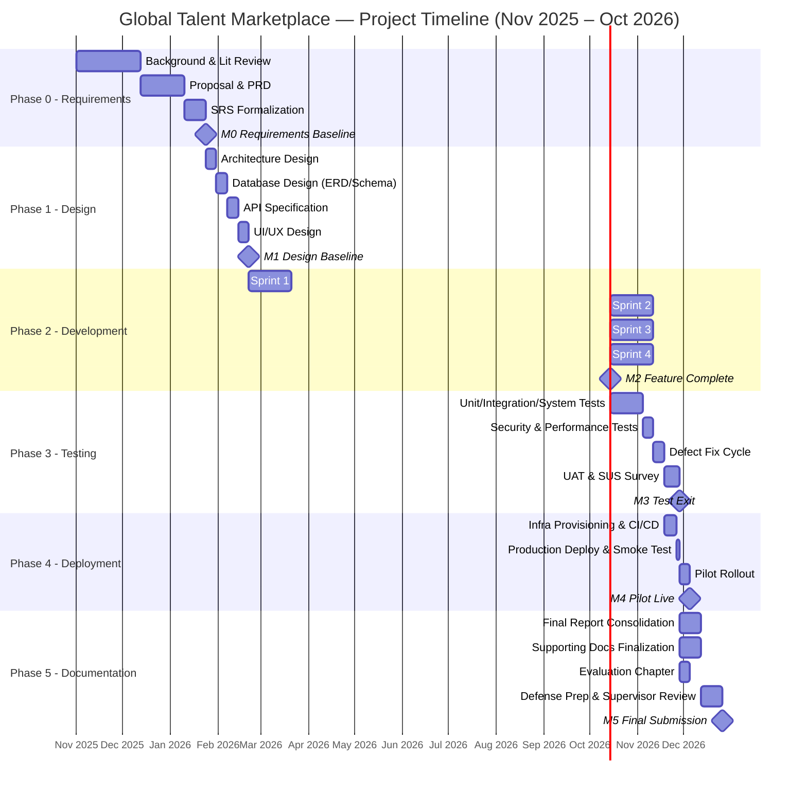

# Project Plan / Gantt Timeline
## Global Multidimensional Talent Marketplace and Casting Management System

| Field | Detail |
|---|---|
| **Document Type** | Project Plan / Gantt Timeline |
| **Product Name** | Global Multidimensional Talent Marketplace and Casting Management System |
| **Prepared For** | Sandun Prabath (A.M.S.P Athapaththu), BSc (Hons) Software Engineering — NSBM Green University |
| **Document Version** | 2.0 |
| **Status** | Active — Build Phase |
| **Companion Documents** | PRD v2.0 (§14 Release Plan), SRS v2.0 (§3 System Features), System Architecture Design Document v2.0, Sprint Backlog v2.0, Test Plan & QA Strategy v2.0, Coding Standards & Git Workflow Guide v2.0 |
| **Overall Project Window** | November 2025 – January 2027 (15 months; build phase Oct 2026 – Jan 2027) |
| **Methodology** | Agile (iterative sprints within Phase 2), per PRD/SRS project methodology |

---

## Revision History

| Version | Date | Description | Author |
|---|---|---|---|
| 1.0 | 2026-03-01 | Initial task-level project plan expanding PRD §14's phase table into a working schedule with dependencies and milestones | Product/Engineering Team |
| 2.0 | 2026-09-08 | Updated project window to reflect October 2026–January 2027 build phase; updated sprint block dates (Phase 2) from Mar–Jun 2026 to Oct 2026–Jan 2027 to match Sprint Backlog v2.0; updated companion document references to v2.0 suite | Engineering Team |

---

## 1. Introduction

### 1.1 Purpose
This document expands the six-phase, month-level roadmap in PRD §14 into a working project plan: task-level activities, estimated durations, dependencies, milestones, and a Gantt-style chart. It is the reference used for supervisor check-ins, self-tracking of progress against the Nov 2025 – Oct 2026 window, and — together with the Sprint Backlog — for day-to-day/week-to-week execution planning within the Development phase.

### 1.2 Intended Audience
- The developer (solo project owner) tracking personal progress against deadlines
- Academic supervisor reviewing progress at scheduled check-ins
- Examiners assessing whether the delivered system and documentation match a credible, well-managed schedule

### 1.3 Relationship to Other Documents
| Document | Relationship |
|---|---|
| PRD §14 (Release Plan / Roadmap) | This plan is the task-level expansion of that six-phase table |
| SRS §3 (System Features 3.1–3.10) | Development-phase tasks are organized around these ten feature modules |
| System Architecture Design Document | Design-phase tasks (architecture, ERD, API spec) trace to this document's structure |
| Test Plan & QA Strategy | Testing-phase tasks and durations are aligned with that document's Jul–Aug 2026 schedule |
| Sprint Backlog *(subsequent document)* | Will break Phase 2's tasks in this plan into sprint-level user stories |
| Risk Register *(subsequent document)* | Schedule risks identified in §7 of this plan feed directly into that register |

### 1.4 Planning Assumptions
- Single-developer execution (solo academic project), with the academic supervisor as reviewer/approver at phase gates, not as an additional development resource.
- Effort estimates assume part-time academic-project availability (evenings/weekends alongside coursework) rather than full-time professional capacity, consistent with the "academic timeline constraints" driver named in the Architecture Document §1.3.
- Phase boundaries in PRD §14 are treated as fixed gate dates (driven by the academic calendar/submission deadline); task-level durations within each phase are the planning variable, not the phase boundaries themselves.
- Documentation deliverables (PRD, SRS, Architecture, DB Design, API Spec, UI/UX, Test Plan, Coding Standards, this Plan, and remaining P1/P2 docs) are treated as parallel/interleaved work alongside implementation, not a separate phase — they are largely front-loaded in Phase 0/1 per the actual document sequence already produced.

---

## 2. Project Phases and Milestones (Gate Summary)

| Phase | Timeframe | Gate Milestone | Exit Criteria |
|---|---|---|---|
| **Phase 0 — Requirements Analysis** | Nov 2025 – Jan 2026 | **M0: Requirements Baseline Approved** | PRD and SRS finalized and reviewed; stakeholder/literature validation complete |
| **Phase 1 — System Design** | Feb 2026 | **M1: Design Baseline Approved** | Architecture Doc, ERD/DB Design, API Spec, UI/UX Design Doc complete and internally consistent |
| **Phase 2 — Development (Core Modules)** | Mar 2026 – Jun 2026 | **M2: Feature-Complete Build** | All 10 SRS features (§3.1–3.10) implemented against API Spec; Coding Standards applied throughout |
| **Phase 3 — Testing & Evaluation** | Jul 2026 – Aug 2026 | **M3: Test Exit / UAT Sign-off** | Test Plan executed (unit/integration/system/security/performance/UAT); exit criteria in Test Plan §17 met |
| **Phase 4 — Deployment** | Aug 2026 – Sep 2026 | **M4: Pilot Live** | System deployed to Vercel/Render/MongoDB Atlas; pilot rollout accessible to UAT participants |
| **Phase 5 — Documentation & Submission** | Sep 2026 – Oct 2026 | **M5: Final Submission** | Final report, evaluation chapter, and complete documentation suite submitted |

**Note on overlap:** Phases 4 and 5 overlap by design — deployment (Aug–Sep) begins before documentation (Sep–Oct) starts, and Phase 3's later weeks (UAT) overlap the start of Phase 4, since UAT is most realistically run against a near-final deployed build rather than strictly pre-deployment. This overlap is reflected in the Gantt chart (§5) and is intentional, not a scheduling error.

---

## 3. Detailed Task Breakdown by Phase

### Phase 0 — Requirements Analysis (Nov 2025 – Jan 2026)

| Task ID | Task | Duration | Depends On | Output |
|---|---|---|---|---|
| P0-T1 | Topic selection, background research, problem justification | 3 weeks | — | Research Background, Problem Justification (thesis Ch.1 material) |
| P0-T2 | Literature review | 3 weeks | P0-T1 | Literature Review section, Sandun Presentation content |
| P0-T3 | Research questions, objectives, significance | 1 week | P0-T2 | Research Question/Objectives section |
| P0-T4 | Competitive/existing-platform analysis | 2 weeks | P0-T1 | Competitive landscape input to PRD |
| P0-T5 | Draft Project Proposal | 2 weeks | P0-T1..T4 | Project Proposal document |
| P0-T6 | Stakeholder/requirements elicitation (personas: Model, Industry Professional, Pageant Organizer, Admin) | 2 weeks | P0-T5 | Persona and requirement inputs to PRD |
| P0-T7 | Draft PRD | 2 weeks | P0-T6 | PRD v1.0 |
| P0-T8 | Draft SRS (formalize PRD into IEEE-830-style FR/NFR) | 2 weeks | P0-T7 | SRS v1.0 |
| P0-T9 | Supervisor review and sign-off — **Milestone M0** | 1 week | P0-T7, P0-T8 | Approved requirements baseline |

**Phase 0 total: ~13 weeks (fits Nov 2025 – Jan 2026 window with buffer).**

---

### Phase 1 — System Design (Feb 2026)

| Task ID | Task | Duration | Depends On | Output |
|---|---|---|---|---|
| P1-T1 | System Architecture Design (layered architecture, component diagram, deployment topology, ADRs) | 1 week | M0 | System Architecture Design Document |
| P1-T2 | Database design (ERD, schema, indexing strategy, data dictionary) | 1 week | P1-T1 | Database Design Document |
| P1-T3 | API Specification (endpoint contracts, request/response schemas, auth/error codes) | 1 week | P1-T1, P1-T2 | API Specification |
| P1-T4 | UI/UX Design (information architecture, wireframes, design system, user flows, accessibility) | 1 week | P1-T3 | UI/UX Design Document |
| P1-T5 | Cross-document consistency pass (Architecture ↔ DB ↔ API ↔ UI/UX) | 3 days | P1-T1..T4 | Reconciled design baseline |
| P1-T6 | Design review — **Milestone M1** | 2 days | P1-T5 | Approved design baseline |

**Phase 1 total: ~4.5 weeks (fits Feb 2026 window).**
**Note:** In practice, these four design documents were produced sequentially in the order Architecture → Database → API → UI/UX, matching the dependency chain above.

---

### Phase 2 — Development, Core Modules (Mar 2026 – Jun 2026)

Development is organized around the ten SRS feature modules (§3.1–3.10), grouped into four monthly sprints/blocks. Ordering follows technical dependency (auth and RBAC must exist before any protected feature) and is the basis for the Sprint Backlog document.

| Sprint Block | Timeframe | SRS Features Covered | Task ID | Task |
|---|---|---|---|---|
| **Sprint Block 1** | Mar 2026 (Weeks 1–4) | 3.1 User Registration & Authentication; 3.2 RBAC | P2-T1 | Project scaffolding (repo structure per Coding Standards, environment config, CI pipeline skeleton) |
| | | | P2-T2 | Auth module: registration, login, JWT issuance, password hashing (bcrypt) |
| | | | P2-T3 | RBAC middleware and role-based route protection |
| | | | P2-T4 | Auth module unit tests |
| **Sprint Block 2** | Apr 2026 (Weeks 5–8) | 3.3 Profile Management; 3.4 Portfolio Management | P2-T5 | Role-specific profile schemas and CRUD endpoints (Model/Industry/Pageant Organizer) |
| | | | P2-T6 | Portfolio module: media upload pipeline (MIME/size validation, cloud storage integration, thumbnail handling) |
| | | | P2-T7 | Frontend: profile creation/edit flows, portfolio management UI |
| | | | P2-T8 | Integration testing: profile + portfolio flows |
| **Sprint Block 3** | May 2026 (Weeks 9–12) | 3.5 Casting Call Management; 3.6 Application Management; 3.7 Search & Filtering | P2-T9 | Casting call CRUD (creation, publishing, lifecycle/status, deadlines) |
| | | | P2-T10 | Application module (apply, status transitions, duplicate-application prevention) |
| | | | P2-T11 | Search/filter endpoints with indexed query patterns (country, category, etc.) |
| | | | P2-T12 | Frontend: casting call browse/create UI, application flow, search/filter UI |
| **Sprint Block 4** | Jun 2026 (Weeks 13–16) | 3.8 Matching & Recommendation; 3.9 Messaging; 3.10 Administration | P2-T13 | Matching engine (attribute-based scoring against pre-filtered candidate pool) |
| | | | P2-T14 | Messaging module (thread-per-application, send/receive, read-state) |
| | | | P2-T15 | Admin module (verification queue, moderation/reports queue, admin action logging) |
| | | | P2-T16 | Frontend: matching results view, messaging UI, admin dashboard |
| | | | P2-T17 | Feature-freeze regression pass across all 10 modules — **Milestone M2** | 

**Phase 2 total: 16 weeks (Mar–Jun 2026), organized as 4 monthly sprint blocks.** Each sprint block ends with a mini-retrospective/demo-to-self checkpoint before the next block begins, consistent with the Agile methodology stated in the PRD/SRS.

---

### Phase 3 — Testing & Evaluation (Jul 2026 – Aug 2026)

| Task ID | Task | Duration | Depends On | Output |
|---|---|---|---|---|
| P3-T1 | Unit test completion/backfill across all modules | 1 week | M2 | Full unit test suite (Test Plan §Unit) |
| P3-T2 | Integration testing (cross-module flows: registration→profile→casting→application→messaging) | 1 week | P3-T1 | Integration test results |
| P3-T3 | System testing (full role-based user journeys, end to end) | 1 week | P3-T2 | System test results |
| P3-T4 | Security testing (OWASP-aligned checklist per Security & Data Protection Policy §9) | 1 week | P3-T2 | Security test results |
| P3-T5 | Performance testing (search/filter latency, matching engine ≤5s/500 candidates, media load) | 1 week | P3-T2 | Performance test results |
| P3-T6 | Defect triage and fix cycle | 1 week | P3-T1..T5 | Closed/resolved defect log |
| P3-T7 | User Acceptance Testing (UAT) sessions with prospective models/recruiters/admins + SUS survey | 1.5 weeks | P3-T6 | UAT results, SUS score against ≥68 target |
| P3-T8 | Test exit review — **Milestone M3** | 3 days | P3-T7 | Sign-off against Test Plan §17 exit criteria |

**Phase 3 total: ~8 weeks (Jul–Aug 2026).**

---

### Phase 4 — Deployment (Aug 2026 – Sep 2026)

| Task ID | Task | Duration | Depends On | Output |
|---|---|---|---|---|
| P4-T1 | Production environment provisioning (Vercel project, Render service, MongoDB Atlas cluster, object storage bucket) | 3 days | M2 (build-ready), can start before M3 fully closes | Provisioned infrastructure |
| P4-T2 | Environment variable / secrets configuration per environment | 2 days | P4-T1 | Configured deploy pipeline |
| P4-T3 | CI/CD pipeline finalization (build → test → deploy) | 3 days | P4-T1, P4-T2 | Working CI/CD pipeline |
| P4-T4 | Production deployment and smoke testing | 2 days | P4-T3, M3 | Live system |
| P4-T5 | Pilot rollout to UAT participant group | 1 week | P4-T4 | Pilot feedback loop |
| P4-T6 | Post-deployment monitoring setup (health-check endpoint, uptime checks) | 2 days | P4-T4 | Monitoring baseline |
| P4-T7 | Deployment sign-off — **Milestone M4** | — | P4-T4..T6 | Pilot confirmed live and stable |

**Phase 4 total: ~4 weeks (Aug–Sep 2026), overlapping the tail end of Phase 3.**

---

### Phase 5 — Documentation & Submission / Handover (Sep 2026 – Oct 2026)

| Task ID | Task | Duration | Depends On | Output |
|---|---|---|---|---|
| P5-T1 | Consolidate final report (Chapters 1–5: Introduction, Literature Review, Methodology, Results/Evaluation, Conclusion) | 2 weeks | M3, M4 | Final Project report (Chap 1–3 draft already produced; extend with results/evaluation) |
| P5-T2 | Finalize supporting documentation suite (this Plan, Risk Register, Sprint Backlog, Deployment Guide, Admin Guide, User Guide) | 2 weeks | Parallel with P5-T1 | Complete documentation suite |
| P5-T3 | Prepare evaluation chapter (test results, SUS score, security checklist evidence) | 1 week | P3-T8 | Evaluation chapter content |
| P5-T4 | Prepare final defense presentation | 1 week | P5-T1 | Updated presentation deck |
| P5-T5 | Supervisor review cycle and revisions | 1 week | P5-T1..T4 | Revised final submission |
| P5-T6 | Final submission — **Milestone M5** | — | P5-T5 | Submitted project |

**Phase 5 total: ~6 weeks (Sep–Oct 2026).**

---

## 4. Dependency Summary

The critical path through the project runs:

```
P0-T7 (PRD) → P0-T8 (SRS) → M0
   → P1-T1 (Architecture) → P1-T2 (DB Design) → P1-T3 (API Spec) → P1-T4 (UI/UX) → M1
   → P2-T2/T3 (Auth+RBAC) → P2-T5/T6 (Profile+Portfolio) → P2-T9/T10/T11 (Casting+Application+Search) → P2-T13/T14/T15 (Matching+Messaging+Admin) → M2
   → P3-T1..T7 (Test cycle) → M3
   → P4-T1..T6 (Deploy) → M4
   → P5-T1..T5 (Docs+Submission) → M5
```

Within Phase 2, the RBAC/Auth block (Sprint Block 1) is the single hardest dependency: every subsequent module's endpoints require the auth/RBAC middleware to exist first, so any slippage in Sprint Block 1 directly delays all of Phase 2 — this is the schedule's primary risk concentration (see Risk Register, forthcoming document, for likelihood/impact scoring).

---

## 5. Gantt Chart (Text/Mermaid Representation)



*(Note: durations above use calendar days as a Mermaid Gantt convention; they map to the week-level estimates in §3. When rendering, adjust start dates to actual calendar dates as the project progresses — this chart is a template, not a fixed record, and should be updated at each phase gate.)*

---

## 6. Resourcing and Effort Notes

| Resource | Allocation |
|---|---|
| Developer (project owner) | 100% allocation across all phases; sole implementer of design, development, testing, and deployment tasks |
| Academic Supervisor | Review/approval role at each milestone gate (M0–M5); not allocated implementation effort |
| UAT Participants | Recruited ad hoc for Phase 3 (P3-T7) and Phase 4 pilot (P4-T5); external to the core schedule, coordinated ahead of Jul 2026 |

Given single-developer execution, the plan deliberately avoids parallel workstreams that would require concurrent attention beyond what is realistic for one person part-time (e.g., frontend and backend within a sprint block are sequenced, not simultaneous, in the task tables above, even though the Gantt chart shows the block as a single bar for readability).

---

## 7. Schedule Risk Flags (Summary — Detailed in Risk Register)

| Flag | Description | Phase Affected |
|---|---|---|
| **Single point of failure: solo developer** | No backup resource if illness/unavailability occurs during a tight block (e.g., Sprint Block 1) | Phase 2 |
| **Sprint Block 1 criticality** | Auth/RBAC delay cascades through all remaining Phase 2 blocks | Phase 2 |
| **UAT participant recruitment** | Depends on external volunteers (models/recruiters/admins), a factor outside direct schedule control | Phase 3 |
| **Phase 3/4 overlap tightness** | UAT (P3-T7) and pilot deployment (P4-T1–T5) run close together; a testing slip compresses deployment time | Phase 3–4 |
| **Documentation load in Phase 5** | Multiple remaining P1/P2 documents (Risk Register, Sprint Backlog, Deployment Guide, Admin Guide, User Guide) plus the final report compete for the same 6-week window | Phase 5 |

These flags are carried forward into the Risk Register with likelihood/impact scoring and named mitigation owners (the developer, in a solo project), consistent with the next document in the documentation queue.

---

## 8. Milestone Tracking Table (For Ongoing Use)

| Milestone | Target Date | Actual Date | Status |
|---|---|---|---|
| M0 — Requirements Baseline Approved | End of Jan 2026 | — | Pending |
| M1 — Design Baseline Approved | End of Feb 2026 | — | Pending |
| M2 — Feature-Complete Build | End of Jun 2026 | — | Pending |
| M3 — Test Exit / UAT Sign-off | End of Aug 2026 | — | Pending |
| M4 — Pilot Live | Mid Sep 2026 | — | Pending |
| M5 — Final Submission | End of Oct 2026 | — | Pending |

*This table is intended to be updated as each milestone is actually reached, providing a running record of planned-vs-actual schedule adherence for the final evaluation chapter.*

---

*End of Project Plan / Gantt Timeline.*
