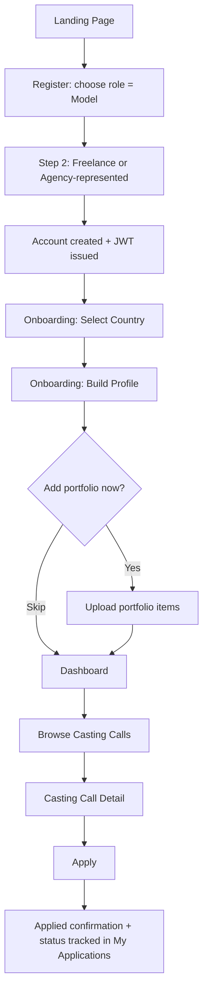
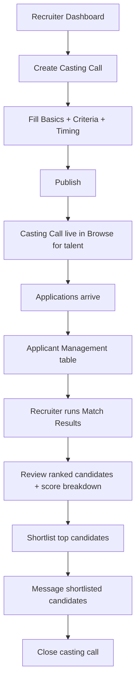
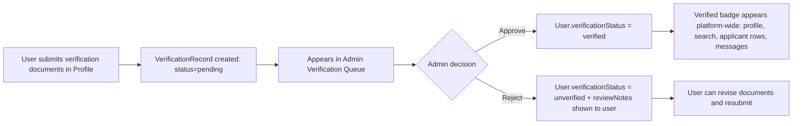
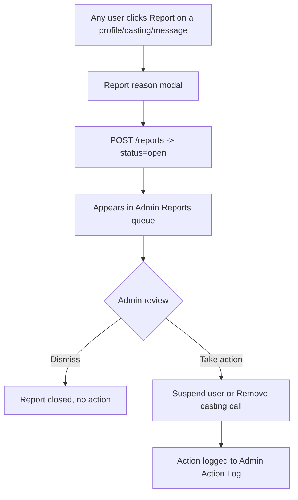

# UI/UX Design Document
## Global Multidimensional Talent Marketplace and Casting Management System

| Field | Detail |
|---|---|
| **Document Type** | UI/UX Design Specification |
| **Product Name** | Global Multidimensional Talent Marketplace and Casting Management System |
| **Prepared For** | Sandun Prabath (A.M.S.P Athapaththu), BSc (Hons) Software Engineering — NSBM Green University |
| **Document Version** | 2.0 |
| **Status** | Active — Approved for Build |
| **Companion Documents** | PRD v2.0, SRS v2.0, System Architecture Design Document v2.0, Database Design Document v2.0, API Specification v2.0 |

---

## Revision History

| Version | Date | Description | Author |
|---|---|---|---|
| 1.0 | 2026-03-01 | Initial UI/UX design specification covering IA, design system, wireframes, and flows for all four roles | Product/Design Team |
| 2.0 | 2026-09-08 | Updated companion document references to v2.0; confirmed Cloudinary URL format (`res.cloudinary.com`) for media cards and portfolio thumbnails; updated status to Active | Design Team |

---

## Table of Contents

1. Introduction & Purpose
2. Design Goals & Principles
3. Personas & Jobs-to-Be-Done (UX Lens)
4. Information Architecture
5. Navigation Model
6. Design System (Tokens, Typography, Components)
7. Global Layout Patterns
8. Screen-by-Screen Specifications
9. Key User Flows
10. Responsive & Mobile Behavior
11. Accessibility Guidelines
12. Content & Microcopy Standards
13. Error, Empty, and Loading States
14. Notification & Feedback Patterns
15. Usability Evaluation Plan
16. Design-to-Development Handoff
17. Open Design Questions

---

## 1. Introduction & Purpose

### 1.1 Purpose
This document translates the functional and non-functional requirements defined in the PRD (v1.0) and SRS (v1.0) into a concrete interface design: information architecture, navigation, a reusable design system, annotated wireframes for every screen required by SRS §3, and the key interaction flows that connect them. It is the binding reference for frontend implementation (React + Tailwind, per System Architecture Design Document §5) and for the usability evaluation stage of the project's DSRM methodology (PRD §3.3, §15).

### 1.2 Audience
- Frontend engineers implementing components and pages
- Backend engineers who need to understand which API responses drive which screen states
- The academic supervisor/examiners assessing design rigor and usability grounding
- UAT participants and evaluators scoring the System Usability Scale (SUS)

### 1.3 Relationship to Other Documents
This document does not restate business rules, validation logic, or data shapes already defined in the SRS, Database Design Document, or API Specification — it references them by ID (e.g., `SRS-FR-5.1`, `POST /castings`) and focuses purely on layout, hierarchy, interaction, and visual system. Where a screen's content depends on an API response, the exact endpoint is cited so frontend engineers can wire real data immediately.

### 1.4 Design Process Grounding
Per the project's Design Science Research Methodology (DSRM — Peffers et al., 2007, cited in PRD §19), this design artifact sits in the **Design & Development** phase and is intended to be evaluated in the **Demonstration/Evaluation** phase via task-based usability testing and a System Usability Scale survey targeting ≥ 68 (PRD §3.3).

---

## 2. Design Goals & Principles

### 2.1 UX Goals (Traceable to PRD Goals, §3.1)
| UX Goal | Traces To |
|---|---|
| A recruiter can find and shortlist a suitable candidate faster than scrolling social media | PRD Goal 4, 5 |
| A model can build a credible, verified-feeling profile without confusion about what "verified" means | PRD Goal 2 |
| Every role understands, within their first session, exactly what actions are available to them and what is off-limits | PRD Goal 1, NFR-Usability |
| Country-first navigation feels like a deliberate, orienting step — not a blocking wall | PRD §6.3, Open Question §18.2 |
| The interface reads as a serious, international creative-industry product — not a generic SaaS admin panel or a knockoff social app | Competitive differentiation, PRD §5 |

### 2.2 Design Principles
1. **Country-first, never country-only.** Country selection orients the experience but is always changeable from a persistent control — it is a lens, not a locked gate (resolves PRD Open Question §18.2 in favor of a *soft, persistent, default filter* rather than a hard blocking gate, subject to stakeholder confirmation — see §17).
2. **Verification is visible, not decorative.** The verified badge, the unverified state, and social-link disclaimers ("unverified external link" per SRS-FR-3.x) must be legible at a glance everywhere a profile is displayed — search results, casting applicant lists, messaging headers.
3. **Recruiters manage volume; talent manages presence.** The two dominant roles have structurally different primary tasks (recruiters triage lists; talent curates a single profile), so their dashboards are deliberately different layouts rather than a single generic "dashboard" template re-skinned by role.
4. **Portfolio media is the product.** Image- and video-heavy layouts get generous space and fast perceived loading (thumbnail-first, per PRD NFR-Performance) rather than being squeezed into small avatar-sized crops.
5. **One accent, used with intent.** A single high-saturation accent color is reserved for primary actions and live/urgent states (open casting call, unread message, pending verification) so it retains meaning instead of becoming wallpaper.
6. **No dark patterns.** Given the product's explicit anti-fraud mission, the interface never uses manipulative patterns (fake urgency, hidden unsubscribe, disguised ads) — this is a stated design constraint, not just an aesthetic preference.

### 2.3 Aesthetic Direction
The subject matter — global fashion, film, and pageant casting — calls for an **editorial, international, slightly formal** visual language rather than a generic startup-SaaS look (rounded cards, soft grey shadows, one border-radius on everything). The direction draws from casting-call call sheets, trade-publication mastheads, and pageant sash typography: confident serif display type, a restrained ink/ivory base palette, and a single "on-air" accent red used the way a tally light or velvet-rope marks something live. Functional, data-dense screens (search results, applicant tables, admin queues) stay disciplined and legible; only the marketing/landing surface and empty/hero states get more editorial treatment. This intentionally avoids the common generated-UI defaults (warm cream + terracotta, dark mode with acid-green, identical soft-shadow cards) called out as clichés for this kind of brief.

---

## 3. Personas & Jobs-to-Be-Done (UX Lens)

Personas are inherited from PRD §4; this section adds the UX-specific "job" each persona is hiring the interface to do, which drives screen priority.

| Persona | Primary Job-to-Be-Done | Screens That Matter Most |
|---|---|---|
| **Freelance Model** | "Make me discoverable and credible without an agency." | Profile editor, Portfolio manager, Casting browse/apply, Recommendations |
| **Agency-Represented Model** | "Show my representation status so recruiters trust me faster." | Profile editor (representation field), Casting browse/apply |
| **Industry Professional (Brand/Director)** | "Find 8 qualified candidates for a shoot by Friday, with minimum manual screening." | Talent search & filter, Casting call creation, Applicant management, Match results |
| **Industry Professional (Agency)** | "Manage my roster's visibility and respond to relevant casting calls." | Org profile, Casting browse (as respondent), Applicant/roster views |
| **Photographer** | "Be discoverable by brands/agencies looking for a collaborator, not just talent." | Profile editor (org type = photographer), Portfolio |
| **Pageant Organizer** | "Publish an official contestant call and manage a structured applicant pipeline." | Org profile, Casting call creation (pageant variant), Applicant management |
| **System Administrator** | "See what needs my attention right now — verifications, reports — and act on it in as few clicks as possible." | Admin queue dashboard, Verification review, Reports/moderation |

---

## 4. Information Architecture

### 4.1 Top-Level Site Map

```
Global Talent Marketplace
│
├── Public (unauthenticated)
│   ├── Landing / Marketing Home
│   ├── How It Works
│   ├── Login
│   ├── Register (role selection → role-specific fields)
│   ├── Forgot Password / Reset Password
│   └── Public Casting Call Preview (read-only, prompts login to apply)
│
├── Onboarding (authenticated, first-session)
│   ├── Country Selection
│   ├── Role-Specific Profile Setup Wizard
│   └── (Model only) Portfolio Starter Upload
│
├── Model / Talent App
│   ├── Dashboard (recommended castings, application status, profile completeness)
│   ├── My Profile (view/edit)
│   ├── My Portfolio (manage media)
│   ├── Browse Casting Calls (search/filter)
│   ├── Casting Call Detail → Apply
│   ├── My Applications (status tracker)
│   └── Messages
│
├── Industry Professional / Pageant Organizer App
│   ├── Dashboard (active castings summary, new applicants, unread messages)
│   ├── Organization Profile (view/edit)
│   ├── My Casting Calls (list, create, edit, close)
│   ├── Casting Call Detail → Applicants → Shortlist/Reject
│   ├── Talent Search (advanced filters)
│   ├── Talent Profile (read-only view, from search or applicant list)
│   ├── Match Results (per casting call)
│   └── Messages
│
├── Admin Console
│   ├── Overview / Metrics Dashboard
│   ├── Verification Queue
│   ├── Users & Organizations (search, suspend)
│   ├── Reports / Moderation Queue
│   ├── Casting Calls (moderation view)
│   └── Admin Action Log
│
└── Shared/Cross-Cutting
    ├── Account Settings (password, notification prefs)
    ├── Notifications Panel
    └── Help / Support
```

### 4.2 Role-Based Navigation Visibility
Navigation items are rendered conditionally by `role` claim from the JWT (per API Specification §2.2); a role never sees a nav entry it cannot access, rather than seeing it disabled/greyed out — this avoids implying a locked "premium" feature that doesn't exist in this product's model.

| Nav Item | Model | Industry Pro | Pageant Org | Admin |
|---|:---:|:---:|:---:|:---:|
| Dashboard | ✓ | ✓ | ✓ | ✓ (metrics) |
| My Profile / Org Profile | ✓ | ✓ | ✓ | — |
| My Portfolio | ✓ | — | — | — |
| Browse Casting Calls | ✓ | — | — | — |
| My Casting Calls | — | ✓ | ✓ | — |
| Talent Search | — | ✓ | ✓ | — |
| My Applications | ✓ | — | — | — |
| Messages | ✓ | ✓ | ✓ | — |
| Verification Queue | — | — | — | ✓ |
| Users & Reports | — | — | — | ✓ |

---

## 5. Navigation Model

### 5.1 Structure
- **Top bar (persistent, all authenticated screens):** logo/wordmark, country selector (pill-shaped, always visible per Principle 2.2.1), global search icon (talent search for recruiters; casting search for talent), notification bell, profile avatar menu.
- **Left sidebar (authenticated app shell, collapsible on tablet, hidden behind a menu icon on mobile):** role-specific primary nav (from §4.2).
- **Contextual sub-navigation:** rendered as tabs within a page (e.g., a Casting Call Detail page has tabs for *Details / Applicants / Match Results*) rather than adding sidebar depth — the sidebar never exceeds one level.
- **Breadcrumbs:** shown on any screen more than one level from a sidebar destination (e.g., `My Casting Calls / Summer Campaign 2026 / Applicants`).

### 5.2 Country Selector Behavior
- Defaults to the country chosen at onboarding (stored on the user's profile) but is changeable at any time from the top bar without leaving the current page.
- Changing country while browsing casting calls or talent search re-scopes results immediately (client-side re-fetch against `GET /castings?country=...` or `GET /search/talent?country=...`) and shows a small inline confirmation ("Showing results for Sri Lanka") rather than a full-page reload.
- An explicit "Browse globally" toggle clears the country scope for users who want cross-border discovery, satisfying both readings of PRD Open Question §18.2 without forcing a hard gate.

---

## 6. Design System

### 6.1 Design Tokens — Color

| Token | Hex | Usage |
|---|---|---|
| `color-ink-900` | `#14120F` | Primary text, headline type, dark surfaces |
| `color-ink-700` | `#332F29` | Secondary text |
| `color-paper-050` | `#F5F1E8` | App background (light, warm ivory — not stark white) |
| `color-paper-100` | `#EAE4D6` | Card/panel background |
| `color-bone-300` | `#C9C2B0` | Borders, dividers, disabled states |
| `color-accent-600` | `#C1442D` | **Casting Red** — primary buttons, "Open" status, unread indicators, live badges |
| `color-accent-700` | `#9E3623` | Accent hover/active state |
| `color-verified-600` | `#4B6A52` | Verified badge, success states, "Shortlisted" status |
| `color-gold-600` | `#B08D3E` | Pageant-module accent, "Featured" badge |
| `color-warn-600` | `#B8862B` | Warning states (pending review, deadline approaching) |
| `color-danger-600` | `#A6291D` | Destructive actions (suspend, reject, delete) — distinct from accent red via darker, less saturated tone used only in confirm dialogs |

The palette deliberately avoids both common generated-UI defaults: it is not a cream-and-terracotta pairing (terracotta is reserved for a different well-known assistant's brand accent) and not a dark-mode-with-acid-accent scheme. Ink-on-ivory with a single desaturated "on-air" red reads as editorial/trade-publication rather than generic tech.

### 6.2 Typography

| Role | Typeface | Notes |
|---|---|---|
| Display / Headlines (H1–H2, marketing hero, section titles) | **Fraunces** (serif, variable optical size) | Used at large sizes only; carries the editorial personality of the brand |
| UI / Body / Data-dense screens | **Inter** | Used for all form fields, tables, buttons, body copy — chosen for legibility at small sizes in dense applicant/search tables |
| Numeric/tabular data (measurements, ages, counts) | **Inter** with `font-variant-numeric: tabular-nums` | Keeps applicant tables and metric cards aligned |

**Type Scale (base 16px):**
| Token | Size | Line Height | Use |
|---|---|---|---|
| `text-display-lg` | 48px | 1.1 | Marketing hero only |
| `text-display-md` | 32px | 1.15 | Page titles (e.g., "My Casting Calls") |
| `text-h2` | 24px | 1.25 | Section headers |
| `text-h3` | 18px | 1.3 | Card titles, table section headers |
| `text-body` | 16px | 1.5 | Default body/form text |
| `text-small` | 14px | 1.4 | Metadata, timestamps, helper text |
| `text-micro` | 12px | 1.3 | Badges, tags, table column labels |

Line lengths for body/reading content are capped at ~72 characters (e.g., casting call descriptions, profile bios) for readability; data tables are exempt as they are scanned, not read linearly.

### 6.3 Spacing & Grid
- Base spacing unit: **4px**, scale: 4/8/12/16/24/32/48/64.
- Desktop content grid: 12-column, 24px gutter, max content width 1280px, with the left sidebar occupying a fixed 240px (collapsible to 64px icon rail).
- Card padding: 24px standard, 16px in dense table-adjacent contexts (e.g., applicant list rows).

### 6.4 Elevation & Surface
- Flat design with **hairline borders** (`1px solid color-bone-300`) rather than drop shadows as the primary separation device — consistent with the editorial/trade-publication direction and avoiding the generic soft-shadow-card look.
- A single, subtle shadow (`0 2px 8px rgba(20,18,15,0.08)`) is reserved for floating/overlay elements only: modals, dropdown menus, toast notifications — so elevation still communicates "this is temporarily on top," not decoration.
- Border radius: **4px** on inputs/buttons/small controls, **8px** on cards/modals. Not zero (which would read as too severe for a warm editorial palette) and not the rounded-pill SaaS default.

### 6.5 Core Components

| Component | Key States | Notes |
|---|---|---|
| **Button — Primary** | default / hover / active / disabled / loading | Filled `color-accent-600`, white text, 4px radius. One primary button per screen section — never two competing primaries side by side. |
| **Button — Secondary** | default / hover / active / disabled | Outlined, `color-ink-900` border and text. |
| **Button — Destructive** | default / hover / confirm-required | `color-danger-600`; always requires a confirmation modal (suspend user, remove casting call, delete portfolio item). |
| **Badge — Verification** | Verified (green, checkmark icon) / Unverified (bone-grey, outline icon) / Pending (gold, clock icon) | Same component used on profile headers, search result cards, applicant rows, messaging headers. |
| **Badge — Casting Status** | Open (accent red, filled) / Closed (ink-grey, outline) / Draft (bone, dashed outline) | |
| **Badge — Application Status** | Submitted (bone) / Shortlisted (verified-green) / Rejected (ink-grey, muted) | Colorblind-safe: status is never conveyed by color alone — always paired with a label and distinct icon shape (see §11.3). |
| **Country Selector Pill** | collapsed (flag/name) / expanded (searchable dropdown) | Persistent in top bar. |
| **Media Card (Portfolio Item)** | image / video (with play affordance) / uploading (progress) / failed (retry) | Uses thumbnail URL from `PortfolioItem.thumbnail_url` (Database Design Document §4). |
| **Applicant Row** | default / shortlisted / rejected / expanded (detail drawer) | Table row on desktop, stacked card on mobile. |
| **Filter Chip** | active / inactive / removable | Used in Talent Search and Casting Browse filter bars. |
| **Modal / Dialog** | default / destructive-confirm | Max width 480px, centered, background scrim `rgba(20,18,15,0.5)`. |
| **Toast Notification** | success / error / info | Bottom-right desktop, bottom-anchored full-width on mobile; auto-dismiss 5s except errors (manual dismiss). |
| **Empty State** | illustration/icon + message + primary action | See §13.2. |
| **Skeleton Loader** | card skeleton / table-row skeleton | Matches the shape of the content it precedes to avoid layout shift. |

---

## 7. Global Layout Patterns

### 7.1 Authenticated App Shell (Desktop, ≥1024px)
```
┌──────────────────────────────────────────────────────────────────┐
│ LOGO   [ Country: Sri Lanka ▾ ]         [search] [bell] [avatar▾] │  ← Top bar, 64px
├───────────┬────────────────────────────────────────────────────────┤
│           │  Breadcrumb (optional)                                 │
│  Sidebar  │  Page Title                              [Primary CTA] │
│  Nav      │  ──────────────────────────────────────────────────── │
│  (240px)  │                                                        │
│           │              Page Content Area                        │
│  • Dash   │                                                        │
│  • Profile│                                                        │
│  • ...    │                                                        │
│           │                                                        │
└───────────┴────────────────────────────────────────────────────────┘
```

### 7.2 Public Marketing Shell
```
┌──────────────────────────────────────────────────────────────────┐
│ LOGO                         How It Works   Login   [Register →] │
├──────────────────────────────────────────────────────────────────┤
│                                                                    │
│        HERO: Editorial full-bleed image mosaic (talent/           │
│        casting imagery) + serif headline + one CTA                │
│                                                                    │
├──────────────────────────────────────────────────────────────────┤
│   Three-column "Built for Models / Recruiters / Organizers"       │
├──────────────────────────────────────────────────────────────────┤
│   Trust section: verification explainer, stats                    │
├──────────────────────────────────────────────────────────────────┤
│   Footer: links, legal, references                                │
└──────────────────────────────────────────────────────────────────┘
```

---

## 8. Screen-by-Screen Specifications

Each screen lists: purpose, key API dependency, layout, and primary/secondary actions.

### 8.1 Registration (`/register`)
**Purpose:** Capture role selection and role-conditional fields in one continuous form (SRS-FR-1.1, 1.2, 1.8). **API:** `POST /auth/register`.

**Layout:** Centered single-column card, max-width 480px, on the paper-050 background.
1. Step indicator (1. Account → 2. Role details) — two steps only, no more, to keep drop-off low.
2. Step 1: Email, Password (with strength meter), Role selector as three large tappable cards (Model / Industry Professional / Pageant Organizer) rather than a dropdown — the role choice is consequential and deserves visual weight.
3. Step 2 (conditional on role):
   - **Model:** Representation status toggle (Freelance / Agency-represented) — required per SRS-FR-1.8.
   - **Industry Professional:** Organization type selector (Brand / Director / Agency / Photographer).
   - **Pageant Organizer:** Organization name, country of registration.
4. Primary CTA: "Create account." Secondary link: "Already have an account? Log in."

**Validation:** Inline, on blur — never only on submit. Password strength shown as a labeled bar (Weak/Fair/Strong), never a bare color bar (accessibility, §11).

### 8.2 Login (`/login`)
**API:** `POST /auth/login`. Simple centered card: email, password, "Forgot password?" link, primary CTA "Log in." Generic error message on failure ("Incorrect email or password") — never reveals which field was wrong, per SRS-FR-1.5 and API error code `UNAUTHORIZED`.

### 8.3 Onboarding — Country & Profile Wizard
Shown once, immediately post-registration, before the main app shell. A 3–4 step wizard (progress dots, not a percentage bar — step count is small and fixed):
1. **Select your country** — searchable list with flags, large tap targets (this is the "soft gate" from §5.2 — skippable via "Decide later," but skipping shows a small persistent reminder chip in the top bar until set).
2. **Build your profile** — role-specific fields (per PRD §11 Data Model): Model gets name/age/height/measurements/category/experience; Industry Pro gets org name/type/country; Pageant Org gets org name/pageant history.
3. **(Model only) Add your first portfolio items** — drag-and-drop uploader, explicitly optional with a "Skip for now, I'll add this later" link so onboarding never blocks on media upload.
4. **Done** — brief summary card + "Go to Dashboard" CTA.

### 8.4 Model Dashboard (`/dashboard`)
**API:** `GET /match/recommendations/castings`, `GET /applications/me`, `GET /profiles/me`.

**Layout (3-zone):**
- **Top:** Profile completeness card ("Your profile is 70% complete — add 2 more portfolio items to reach Strong") with a horizontal progress bar and a direct CTA into Portfolio.
- **Middle:** "Recommended for you" — horizontally scrollable casting call cards (image, title, org, country, deadline), sourced from the recommendation endpoint (SRS-FR-8.4).
- **Bottom:** "Your applications" — compact status list (Submitted/Shortlisted/Rejected badges) linking to `My Applications`.

### 8.5 My Profile — Model (`/profile`, edit mode)
**API:** `GET/PUT /profiles/me`.

**Layout:** Two-column on desktop — left column is a sticky profile-card preview (exactly as recruiters will see it, including the verification badge), right column is the editable form grouped into collapsible sections: *Basic Info, Measurements & Category, Experience History, Representation Status, Social Links (labeled "unverified external references"), Verification (upload documents → status shown as Pending/Verified badge, linking to admin flow SRS-FR-10.1)*.

This live-preview pattern (edit on the right, see the real card on the left) directly supports Design Principle 2.2.2 — verification and presentation are never abstract.

### 8.6 Portfolio Manager (`/portfolio`)
**API:** `POST /portfolio/upload`, `GET /portfolio/{profileId}`, `PATCH /portfolio/{itemId}/reorder`, `DELETE /portfolio/{itemId}`.

**Layout:** Masonry/grid of media cards grouped by category tabs (*Photos / Runway / Commercial / Achievements*, per PRD §6.1 categorization). Drag-to-reorder within a category (SRS-FR-4.6). An "Upload" dropzone is always the first tile in the grid. Each media card shows a small type icon (photo/video), and video cards show a play-button affordance over the thumbnail rather than autoplaying (bandwidth and NFR-Performance consideration). Upload progress renders in-place on the card (skeleton → progress ring → final thumbnail) rather than a separate upload modal, so the grid never jumps.

### 8.7 Browse Casting Calls (`/castings`, talent view)
**API:** `GET /castings?country=&category=...`.

**Layout:** Left filter rail (country — synced with global selector, category, deadline range) + right result grid of casting call cards. Each card: cover image, title, organization name with verification badge, country, category tag, deadline countdown chip ("5 days left" in warn-gold if <3 days), and a single "View & Apply" CTA. Infinite scroll with skeleton cards, backed by the pagination `meta` object (API Specification §2.5).

### 8.8 Casting Call Detail — Talent View (`/castings/{id}`)
**API:** `GET /castings/{id}`, `POST /applications`.

**Layout:** Full-width hero image, title + org (with badge) + status badge, structured criteria table (age range/height range/experience/category/country/deadline — mirrors `CastingCall.criteria`), full description below the fold, and a persistent bottom-anchored "Apply Now" bar on mobile (so the CTA is never scrolled out of reach). Applying triggers a lightweight confirm modal, not a full-page redirect, then updates in place to an "Applied ✓" state (button becomes disabled/labeled, per `INVALID_STATE_TRANSITION` guard on duplicate applications).

### 8.9 My Applications (`/applications`)
**API:** `GET /applications/me`. Simple status-grouped list (Submitted / Shortlisted / Rejected as three tabs or filter chips), each row linking back to the casting call detail. Rejected applications are visually de-emphasized (muted, not hidden) so the model retains a full history.

### 8.10 Recruiter Dashboard (`/dashboard`, Industry Pro / Pageant Org)
**API:** `GET /castings?creatorId=me`, `GET /admin/metrics`-equivalent scoped summary (or aggregated client-side from casting/application endpoints).

**Layout:** Card-grid of KPI tiles (Active casting calls, New applicants this week, Unread messages) at top, followed by a table of "My Casting Calls" (title, status badge, applicant count, deadline, quick actions: View / Edit / Close). This is a **table-first**, not card-first, layout — per Design Principle 2.2.3, recruiters triage volume.

### 8.11 Create/Edit Casting Call (`/castings/new`, `/castings/{id}/edit`)
**API:** `POST /castings`, `PUT /castings/{id}`.

**Layout:** Single-column form, logically grouped: *Basics (title, description, cover image), Criteria (country, category, age range slider, height range slider, experience level, required skills as tag-input), Timing (deadline date picker), Visibility (draft/publish toggle)*. A live "Preview as talent sees it" panel (collapsible on desktop, a separate tab on mobile) renders the exact card/detail layout from §8.7/§8.8 as the recruiter types — closing the loop between creation and consumption.

### 8.12 Applicant Management (`/castings/{id}` → "Applicants" tab)
**API:** `GET /castings/{id}/applicants`, `PATCH /applications/{id}/status`.

**Layout:** Dense table: applicant thumbnail, name, verification badge, key attributes (age/height/category — the exact attributes the casting call filtered on, surfaced inline so the recruiter doesn't have to open each profile to compare), applied date, status badge, and row actions (Shortlist / Reject / Message / View full profile). Bulk-select checkboxes allow shortlisting multiple applicants at once. Clicking a row opens a right-side drawer with the full profile and portfolio preview without leaving the table (avoids losing scroll position across dozens of applicants).

### 8.13 Talent Search (`/search`, Recruiter/Admin)
**API:** `GET /search/talent`.

**Layout:** Same filter-rail + result-grid pattern as §8.7 but filters are richer (country, age range, height range, category, experience, skills multi-select, "has verified profile" toggle, "has ≥3 portfolio items" toggle for portfolio-availability filtering per SRS-FR-7.x). Result cards match the model profile-card component used everywhere else in the product (consistency principle).

### 8.14 Match Results (`/castings/{id}` → "Match Results" tab)
**API:** `POST /match/castings/{id}/compute`, `GET /match/castings/{id}/results`.

**Layout:** Ranked list (not a table) — each row shows rank number, profile card, and a **suitability score bar** (0–100%) with a small breakdown-on-hover tooltip showing which criteria matched/didn't (age ✓, height ✓, skills partial). An explicit caption above the list states: *"These are suggested matches based on profile attributes, not a decision — review each candidate before shortlisting,"* directly reflecting PRD §12.2's explainability requirement and avoiding any implication of automated decision-making.

### 8.15 Messaging (`/messages`)
**API:** `GET /messages/threads`, `GET /messages/threads/{id}`, `POST /messages/threads/{id}`, `PATCH /messages/{id}/read`.

**Layout:** Classic two-pane inbox — thread list (left, 320px, showing counterpart name, verification badge, last message preview, unread dot in accent red) and active thread (right, message bubbles, sender-aligned left/right, timestamp on hover). Every thread header shows which casting call/application context it's tied to (per SRS-FR-9.5), displayed as a small pill link back to that casting call — messaging is never a free-floating DM, it's always contextualized.

### 8.16 Admin Overview (`/admin`)
**API:** `GET /admin/metrics`.

**Layout:** KPI tile row (Total users by role, Active casting calls, Total applications, Verified-profile ratio — matching the exact shape of the `/admin/metrics` response) followed by two priority queues surfaced directly on the landing screen: *Pending Verifications (count + "Review" CTA)* and *Open Reports (count + "Review" CTA)* — reflecting Design Principle "see what needs attention right now" from the admin persona's JTBD.

### 8.17 Verification Queue (`/admin/verifications`)
**API:** `GET /admin/verifications`, `PATCH /admin/verifications/{recordId}`.

**Layout:** Queue-style list (not a table) — one submission per expandable card showing submitted documents (image viewer), the linked user's current profile summary, and two large, clearly differentiated actions: **Approve** (verified-green) and **Reject** (danger-red, requires a reason note per `reviewNotes` field). Approving/rejecting immediately removes the item from the queue with an undo toast (5s window) rather than a confirm-before-action modal — optimized for admin throughput on a repetitive task, with the safety net of undo instead of friction on every action.

### 8.18 Reports / Moderation Queue (`/admin/reports`)
**API:** `GET /admin/reports`, `PATCH /admin/reports/{reportId}`. Similar queue pattern to §8.17; each report card shows the reported entity type/preview (profile, casting call, or message snippet), the reporter's stated reason, and actions (Dismiss / Take Action → contextual: Suspend User / Remove Casting Call, per `DELETE /admin/castings/{id}` and `PATCH /admin/users/{userId}/suspend`).

### 8.19 Users & Organizations (`/admin/users`)
Searchable/filterable table (email, role, verification status, active/suspended, joined date) with row-level Suspend action (destructive, confirm modal required — this is the one admin action that *does* get a blocking confirm, since unlike verification queue triage it's rare and high-impact).

### 8.20 Admin Action Log (`/admin/logs`)
Read-only, reverse-chronological table (admin name, action type, target entity, timestamp) with filters — exists primarily for accountability/audit, low visual priority, plain table with no custom components needed.

---

## 9. Key User Flows

### 9.1 Registration → First Casting Application (Model)


### 9.2 Casting Call Creation → Match → Shortlist (Recruiter)


### 9.3 Profile Verification Lifecycle


### 9.4 Reporting & Moderation


---

## 10. Responsive & Mobile Behavior

### 10.1 Breakpoints
| Breakpoint | Width | Behavior |
|---|---|---|
| `mobile` | < 640px | Single column; sidebar becomes a bottom-anchored or slide-in hamburger menu; tables collapse to stacked cards; filter rail becomes a full-screen modal triggered by a "Filters" button. |
| `tablet` | 640–1023px | Sidebar collapses to icon-only rail (64px); two-column layouts (e.g., Profile edit) stack. |
| `desktop` | ≥ 1024px | Full layout as specified in §7.1. |

### 10.2 Mobile-Specific Patterns
- **Applicant table → Applicant cards:** each applicant becomes a stacked card with the same information hierarchy (thumbnail, name, badge, key attributes, status, actions in a kebab menu).
- **Persistent bottom action bar** on Casting Call Detail (Apply) and Applicant Detail drawer (Shortlist/Reject) so primary actions are always thumb-reachable.
- **Country selector** collapses to a flag icon only in the compact mobile top bar; tapping opens a full-screen search.
- **Messaging** uses a single-pane pattern on mobile (thread list → tap → full-screen conversation → back button), not the two-pane desktop layout.

### 10.3 Media/Performance Considerations on Mobile
Portfolio and casting-call cover images are served at a mobile-appropriate resolution (responsive `srcset`, thumbnail-first per PRD NFR-Performance) to keep perceived load time low on mobile data connections — directly supporting the "sub-3-second" latency target in PRD §3.3 for markets with variable connectivity.

---

## 11. Accessibility Guidelines

Per PRD NFR-Accessibility ("reasonable adherence to basic web accessibility practices... full WCAG compliance is P2"), this release targets **WCAG 2.1 Level A/AA on core flows**, not full AA/AAA certification:

1. **Color contrast:** All text/background pairs in the design system (§6.1) meet at least 4.5:1 for body text and 3:1 for large text (verified against `color-ink-900` on `color-paper-050`, and white text on `color-accent-600`).
2. **Never color alone:** Every status (verified/unverified, application status, casting status) pairs color with an icon and a text label — critical given the frequency of status badges throughout the product.
3. **Semantic HTML & landmarks:** Sidebar as `<nav>`, main content as `<main>`, forms with proper `<label>` associations (not placeholder-as-label).
4. **Keyboard navigation:** All interactive elements (filters, modals, dropdowns, drag-to-reorder portfolio items) have a keyboard-operable equivalent; drag-to-reorder additionally exposes "Move up/Move down" buttons for non-pointer users.
5. **Focus states:** Visible focus ring (`2px solid color-accent-600`, offset 2px) on every focusable element — never suppressed.
6. **Alt text:** Mandatory alt-text field on every portfolio upload and casting-call cover image (enforced at the upload UI, not just recommended), per PRD NFR-Accessibility.
7. **Media captions/labels:** Video portfolio items require a short text label (used as both accessible name and hover caption).
8. **Reduced motion:** Respects `prefers-reduced-motion`; skeleton-loader shimmer and modal transitions are disabled/simplified accordingly.

---

## 12. Content & Microcopy Standards

- **Active voice, plain language, role-aware terms.** A model "applies" to a casting call; a recruiter "shortlists" an applicant — buttons and resulting toasts always match ("Apply" → "Applied ✓"; "Shortlist" → "Shortlisted").
- **No invented urgency.** Deadline countdowns state real dates/times ("Closes in 3 days — Sep 12") rather than manufactured scarcity language.
- **Verification language is precise and non-legal.** Per PRD §13's explicit note that verification is administrative, not legal-grade, UI copy never says "identity verified" — it says "Profile verified by [Platform] admin team" with a tooltip explaining what that does and does not confirm.
- **Errors are specific and actionable**, written in the interface's voice: *"That file is larger than 25MB. Try a compressed version or a shorter video clip."* — never a bare "Upload failed."
- **Sentence case throughout** (buttons, labels, headers) — no tracked-out all-caps labels, consistent with the editorial-not-corporate direction in §2.3.

---

## 13. Error, Empty, and Loading States

### 13.1 Error States
| Scenario | Treatment |
|---|---|
| Form validation error | Inline, red text below field, field border turns `color-danger-600`, focus moves to first invalid field on submit attempt |
| API `409 DUPLICATE_RESOURCE` (e.g., duplicate application) | Non-blocking toast + button reverts to "Applied ✓" if the duplicate is the user's own prior action |
| API `403 FORBIDDEN` (role mismatch, shouldn't normally be reachable via UI) | Full-page "You don't have access to this page" state with a link back to the user's dashboard |
| API `500`/network failure | Toast: "Something went wrong on our end. Please try again," with a manual retry action — never a silent failure |

### 13.2 Empty States
Every list/grid screen has a designed empty state (not a blank white area):
- **No casting calls match your filters:** icon + "Try widening your country or category filters" + "Clear filters" CTA.
- **No portfolio items yet (model, new account):** icon + "Your portfolio is empty — recruiters are 3x more likely to shortlist profiles with at least 3 portfolio items" + "Add your first item" CTA (uses a real, non-manipulative stat placeholder to be replaced with actual pilot data once available — flagged in §17).
- **No applicants yet (recruiter, new casting call):** icon + "No applications yet — casting calls typically get their first response within 48 hours" + share/copy-link action.
- **Admin queues empty:** a calm, positive state ("You're all caught up ✓") rather than a generic empty-box graphic.

### 13.3 Loading States
Skeleton loaders (matching final content shape) are used for all list/grid/table screens; spinners are reserved only for button-level in-progress actions (e.g., "Saving..." inside a submit button) — never a full-page spinner for content that has a known shape.

---

## 14. Notification & Feedback Patterns

| Event | In-App Treatment |
|---|---|
| New message received | Bell badge count + toast if user is active elsewhere in the app; unread dot in Messages thread list |
| Application status changed (shortlisted/rejected) | Bell badge + entry in Notifications panel; email is explicitly out of scope for MVP per PRD FR-20 (P1) — flagged as a P1 enhancement, not built in v1 |
| Verification approved/rejected | Bell badge + banner at top of Profile page until acknowledged |
| Casting call deadline approaching (recruiter's own casting) | Badge on "My Casting Calls" nav item + gold deadline chip on the casting row |

All in-app notifications are logged to a persistent Notifications panel (bell icon dropdown), not only ephemeral toasts, so users don't lose track of events that happened while they were away.

---

## 15. Usability Evaluation Plan

Directly supports PRD §3.3 (SUS ≥ 68 target) and §15 (UAT):

1. **Task-based testing script** — representative tasks per role, e.g.:
   - Model: "Update your height in your profile, then find and apply to a casting call in your country."
   - Recruiter: "Create a casting call for a runway show in your country, then view its match results."
   - Admin: "Approve the oldest pending verification request."
2. **Metrics captured per task:** completion (yes/no), time-on-task, number of errors/misclicks, System Usability Scale (10-item, 5-point Likert) survey administered post-session.
3. **Target sample:** small pilot cohort per persona (PRD §16 constraints acknowledge limited pilot sample size) — minimum 1 participant per primary role for qualitative signal, more for the SUS score to be meaningful.
4. **Iteration loop:** findings feed back into this document's wireframes before final development sign-off, and are documented in the project's evaluation chapter per the DSRM methodology.

---

## 16. Design-to-Development Handoff

- This document is the source of truth for layout/hierarchy/component states; exact pixel-level assets (icon set, imagery, high-fidelity mockups) are expected to be produced in a design tool (Figma recommended) using the tokens in §6 as the base theme, then exported as a shared component library.
- Frontend implementation should map §6.5 components to a small reusable component set (e.g., `<Button>`, `<Badge>`, `<MediaCard>`, `<StatusPill>`) rather than re-implementing per-screen — enforced via the Coding Standards document (companion doc, P1).
- Every screen in §8 lists its exact API dependency so frontend and backend can build against the same contract in parallel, consistent with the API Specification's stated purpose (§1.1 of that document).

---

## 17. Open Design Questions

1. **Country gate strictness (ties to PRD Open Question §18.2):** This document assumes a *soft, skippable* country step at onboarding with a persistent, always-changeable selector thereafter. Confirm this matches the intended product behavior before implementation, versus a stricter "must select before any browsing" gate.
2. **Empty-state statistics** (e.g., "3x more likely to be shortlisted" in §13.2) are illustrative placeholders — replace with real pilot data once available, or soften to non-numeric encouragement if no data exists at launch.
3. **Email notifications** are explicitly deferred (PRD FR-20/FR-28 are P1) — confirm whether any email touchpoints (e.g., password reset, which does require email delivery per SRS-FR-1.7) should get a designed email template as part of this document or a separate transactional-email spec.
4. **Video autoplay/streaming behavior** for portfolio runway videos on slower connections — this document specifies "click-to-play, no autoplay" as the default; confirm this is acceptable given the visual-portfolio-first product goal, or whether a muted-autoplay-on-hover pattern is preferred for desktop.
5. **Pageant-specific UI variant:** the Pageant Organizer casting-call flow currently reuses the same form/detail pattern as general Industry Professional castings with only copy differences (per PRD's "structured, tabulation-adjacent workflows" note in §2.2) — confirm whether a distinct visual treatment (e.g., the gold accent token, `color-gold-600`) should apply more broadly to differentiate pageant listings in browse/search results.

---

*End of UI/UX Design Document.*
