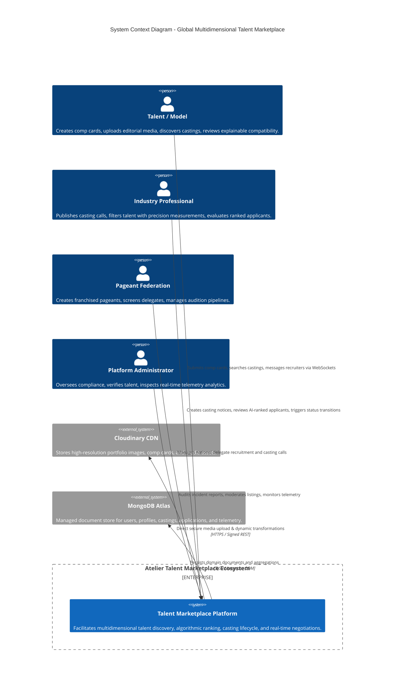
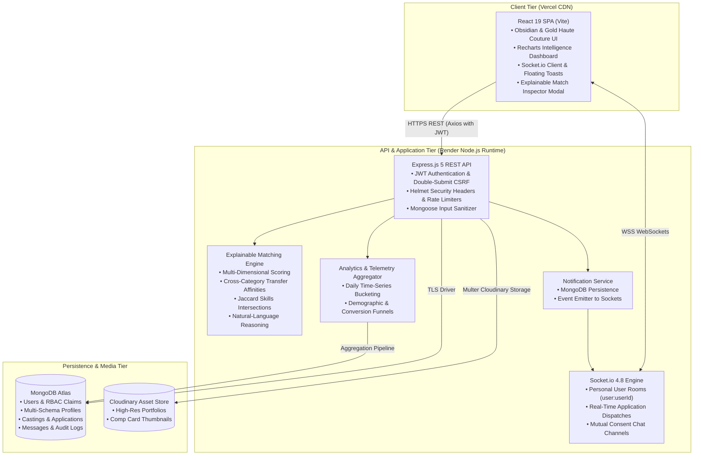
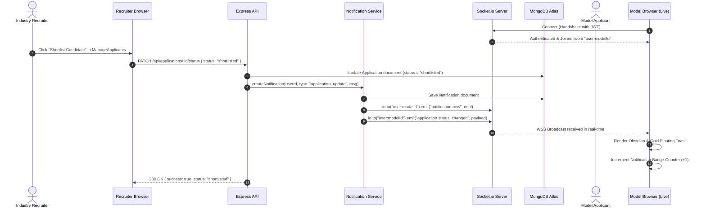
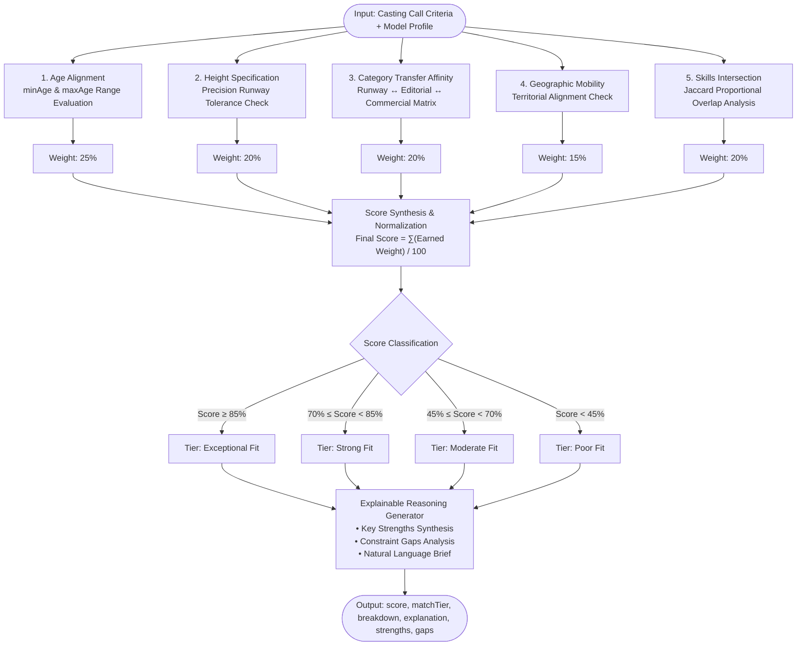

# System Architecture & Component Interaction Diagrams

**Project:** Global Multidimensional Talent Marketplace and Casting Management System  
**Candidate:** Sandun Prabath (A.M.S.P Athapaththu) — BSc (Hons) Software Engineering, NSBM Green University  
**Supervisor:** Ms. Lakni Peiris  
**Document Version:** 2.0 (Post-Phase 2 Platform Expansion)

---

## 1. C4 Level 1: System Context Diagram

The system context diagram illustrates the external actors (Models, Industry Professionals, Pageant Organizers, Platform Administrators) and external systems (Cloudinary, MongoDB Atlas) interacting with the Talent Marketplace Platform.

---

## 2. C4 Level 2: Container Architecture Diagram

Details the concrete deployable units: React 19 SPA hosted on Vercel, Node.js Express & Socket.io API hosted on Render, MongoDB Atlas database, and Cloudinary media CDN.

---

## 3. Real-Time WebSocket Notification Sequence Flow

Illustrates how an application status transition triggers both transactional database persistence and sub-second real-time toast dispatches to the applicant.

---

## 4. Explainable Multi-Dimensional Matching Engine Pipeline

---

## 5. Security Architecture & Threat Defense Matrix

| Security Layer | Threat Mitigated | Implementation Mechanism | Validation Status |
|---|---|---|---|
| **Identity & Authentication** | Credential stuffing, session hijacking | Salted bcrypt (cost factor 10), in-memory JWT access tokens, HttpOnly refresh cookies with rotation | Verified (42+ unit tests) |
| **Transport & Headers** | Clickjacking, MIME-sniffing, XSS | `helmet()` with strict CSP, `X-Frame-Options: DENY`, `X-Content-Type-Options: nosniff` | Active in `server.js` |
| **CSRF Defense** | Cross-Site Request Forgery on state changes | Double-submit cookie pattern (`XSRF-TOKEN` cookie validated against `X-XSRF-TOKEN` header) | Active in `csrfMiddleware.js` |
| **Injection Defense** | NoSQL query selector injection (`$gt`, `$ne`) | Recursive `mongoSanitize` middleware stripping operator keys on `req.body`, `req.query`, and `req.params` | Active in `security.js` |
| **DDoS & Abuse Control** | Endpoint flooding, brute-force password guessing | Sliding-window IP rate limiters (300 req/15 min global API; 10 req/15 min on auth routes) | Active in `security.js` |
| **Authorization & Privacy** | Broken Object Level Authorization (IDOR) | Scoped ownership validations on castings, applications, and direct messaging channels | Verified in `socketManager.js` |
