# Final Viva Voce Live Demonstration Script & Defense Guide

**Candidate:** Sandun Prabath (A.M.S.P Athapaththu) — Index: [Student ID]  
**Degree:** BSc (Hons) Software Engineering — NSBM Green University  
**Project:** Global Multidimensional Talent Marketplace and Casting Management System  
**Supervisor:** Ms. Lakni Peiris  
**Target Duration:** 15 – 20 Minutes (Demo: 10 mins · Technical Defense: 5-10 mins)

---

## 1. Demo Preparation Checklist (5 Minutes Prior)

Before the examiners begin:
1. **Start Services:**
   * Backend: `cd backend && npm run dev` (Ensure MongoDB connected & Socket.io listening on port 5000).
   * Frontend: `cd frontend && npm run dev` (Runs at `http://localhost:5173`).
2. **Open Browser Windows:**
   * **Window A (Chrome - Recruiter / Admin):** Open `http://localhost:5173/admin` (logged in as `admin@admin-mod-test.local`).
   * **Window B (Firefox or Incognito - Model):** Open `http://localhost:5173/login` (ready to log in as a model).
   * Having two distinct browsers open side-by-side visually proves **real-time WebSocket dispatches without page reloading**!

---

## 2. Timed Demonstration Walkthrough

```mermaid
gantt
    title Viva Voce Demonstration Flow (15 Minutes)
    dateFormat  m
    axisFormat %M min
    section Introduction
    Research Problem & Motivation : 0, 2
    section Live Demo
    Obsidian & Gold Aesthetics & Comp Card : 2, 5
    Casting Call & Multidimensional Matching : 5, 8
    Real-Time WebSocket Toast & Direct Chat : 8, 11
    Admin Command Center & Recharts Telemetry : 11, 14
    section Defense
    Examiner Q&A & Algorithmic Defense : 14, 20
```

---

### Step 1: Introduction & Research Motivation (0:00 – 2:00)
* **What to Say:**
  > "Good morning, respected members of the examination board and my supervisor Ms. Lakni Peiris. Today, I present the **Global Multidimensional Talent Marketplace and Casting Management System**.
  >
  > In the contemporary fashion, media, and pageant industries, talent scouting suffers from critical fragmentation: agency lock-in, reliance on unstandardized social media DMs, and lack of explainability in casting decisions.
  >
  > Following the **Design Science Research Methodology (DSRM)**, this project develops a production-grade digital artifact that bridges talent and casting directors with:
  > 1. Multi-dimensional explainable candidate ranking.
  > 2. Sub-second WebSocket event distribution.
  > 3. An haute-couture design language tailored specifically for high-fashion stakeholders."

---

### Step 2: The Obsidian & Gold Haute Couture Interface & Digital Comp Cards (2:00 – 5:00)
* **Action:** Show the landing page (`/`), scroll through the editorial runway hero, and navigate to a model's Public Profile (`/p/:id`).
* **What to Say:**
  > "First, we observe the **Obsidian and Gold Haute Couture design system**. Rather than generic SaaS UI, the interface adopts obsidian black surfaces (`#09090b`), liquid gold accents (`#d4af37`), and glassmorphism panels that reflect high-fashion luxury.
  >
  > On the talent profile, we see the digital **Comp Card (Composite Card)**. It presents standardized editorial measurements—height in centimeters, bust, waist, hips, and eye color—alongside high-resolution Cloudinary media with interactive lightbox preview and verification badges."

---

### Step 3: Casting Calls & Explainable AI Matching Engine (5:00 – 8:00)
* **Action:** In Window A, navigate to **Manage Applicants** (`/castings/:id/applicants`). Click the **Match Breakdown** button (`95% Match`) to open the **Explainable Compatibility Inspector Modal**.
* **What to Say:**
  > "Here is our core algorithmic contribution: the **Multi-Dimensional Explainable Matching Engine** (SRS-FR-8).
  >
  > Unlike opaque black-box recommendations, our engine evaluates candidate fitness across five weighted orthogonal dimensions:
  > 1. **Age Alignment (25%):** Tolerance evaluation against target bounds.
  > 2. **Height Specification (20%):** Precision runway specification checking.
  > 3. **Category Affinity Matrix (20%):** Evaluates cross-disciplinary mobility, such as runway models successfully transferring to editorial fashion with a 60% affinity score.
  > 4. **Geographic Mobility (15%):** Territorial proximity alignment.
  > 5. **Skills Intersection (20%):** Jaccard overlap analysis.
  >
  > In the inspector modal, examiners can see the animated radial gauge, clear factor breakdown, and natural-language reasoning that gives casting directors actionable, defensible transparency."

---

### Step 4: Real-Time WebSocket Dispatches & Direct Line Chat (8:00 – 11:00)
* **Action:** Place Window A (Recruiter) and Window B (Model) side-by-side. In Window A, change the applicant status to **"Shortlisted"** or **"Accepted"**.
* **Observe:** Window B instantly displays the animated floating gold toast:  
  *"Live Dispatch Alert: Your application for 'Milan Fashion Week' has been updated to Shortlisted"* with an action link!
* **What to Say:**
  > "Notice how Window B instantaneously responded without a browser refresh. The system implements an event-driven architecture using **Socket.io 4.8** with personal user rooms (`user:userId`).
  >
  > When an applicant reaches 'Accepted' status, mutual consent is established, unlocking the direct communication channel. The direct chat features message encryption styling, typing status dots, and timestamped persistence."

---

### Step 5: System Command Center & Recharts Telemetry (11:00 – 14:00)
* **Action:** In Window A, switch to the **Admin Dashboard** (`/admin`) and show the **Analytics & Intelligence** tab. Toggle between **7D**, **30D**, and **90D**.
* **What to Say:**
  > "Finally, we examine institutional oversight in the **Admin Command Center**.
  >
  > Integrated with **Recharts**, the telemetry tab renders:
  > 1. An **Activity Growth & Engagement Wave** tracking talent registrations, casting notices, and submissions over time with multi-gradient fills.
  > 2. A **Stakeholder Ecosystem Balance Donut** demonstrating marketplace equilibrium across models, directors, and pageant federations.
  > 3. A **Casting Pipeline Funnel** monitoring conversion velocity from submission through shortlist to confirmed contract.
  >
  > This provides institutional supervisors with complete data governance and platform health metrics."

---

## 3. Anticipated Viva Voce Examiner Questions & Rehearsed Responses

### Q1: "Why did you build a rule-based explainable matching engine instead of a deep learning embedding model?"
* **Answer:**
  > "Casting directors in high-fashion and pageant competitions operate under strict physical and contractual constraints (such as exact garment fitting sizes and age regulations).
  > A purely neural embedding or collaborative filtering approach suffers from the 'black box' problem—it cannot tell a recruiter *why* a candidate was recommended or why a candidate fell short by 2 centimeters.
  > Our multi-dimensional engine calculates deterministic distance metrics and outputs human-readable rationales (SRS-FR-8.x), satisfying both academic explainability criteria and practical industry compliance."

### Q2: "How do you protect your WebSocket connections and prevent unauthorized eavesdropping?"
* **Answer:**
  > "WebSocket handshakes are authenticated during the connection phase using the same HS256-signed JWT token as the REST API.
  > Furthermore, before any client joins a match room or sends a message, our `isAuthorizedForApplication` check verifies database-level ownership—only the applicant model and the verified casting creator are permitted into the room.
  > Any unauthorized connection attempt is rejected immediately with an authorization error."

### Q3: "How is your system protected against Cross-Site Request Forgery (CSRF) and NoSQL Injection?"
* **Answer:**
  > "We implement a double-submit cookie CSRF defense: the server issues a cryptographically random `XSRF-TOKEN` cookie, and all state-mutating requests (POST, PUT, PATCH, DELETE) must present a matching `X-XSRF-TOKEN` header.
  > Against NoSQL injection, our `mongoSanitize` middleware recursively strips MongoDB operator keys (such as `$gt` and `$ne`) from request bodies, parameters, and query strings before reaching Mongoose queries."

### Q4: "How does your project adhere to the DSRM research framework?"
* **Answer:**
  > "Following Peffers et al. (2007) DSRM stages:
  > 1. **Problem Identification:** Literature review and stakeholder analysis in Sri Lanka and international casting ecosystems.
  > 2. **Objectives of a Solution:** Documented in our SRS v2.0 and PRD.
  > 3. **Design & Development:** Developing the modular architecture, explainable matching engine, and haute-couture UI artifact.
  > 4. **Demonstration:** End-to-end scenarios demonstrated today across all 4 actor roles.
  > 5. **Evaluation:** Validated through our comprehensive UAT report (10/10 passed) and automated test suite (62 tests across 11 suites with 100% pass rate)."
